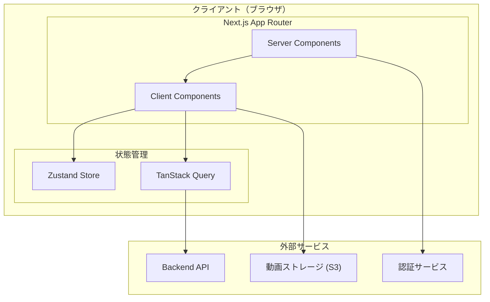
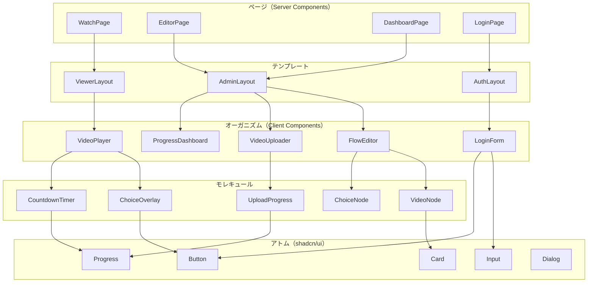
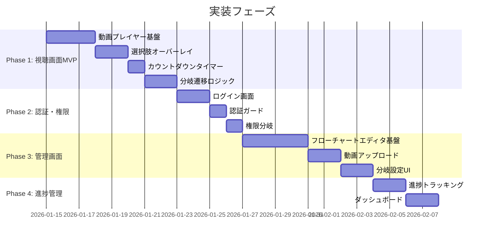
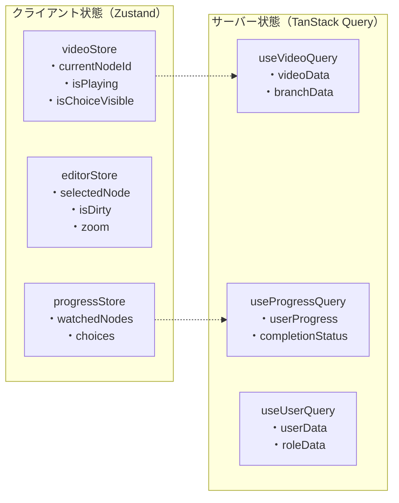
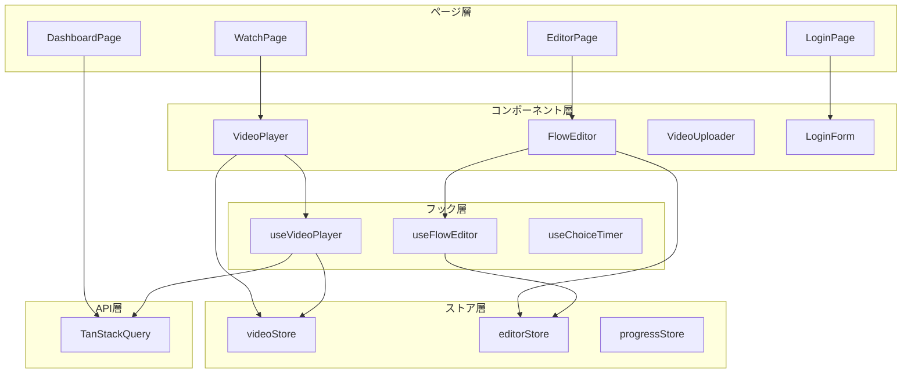
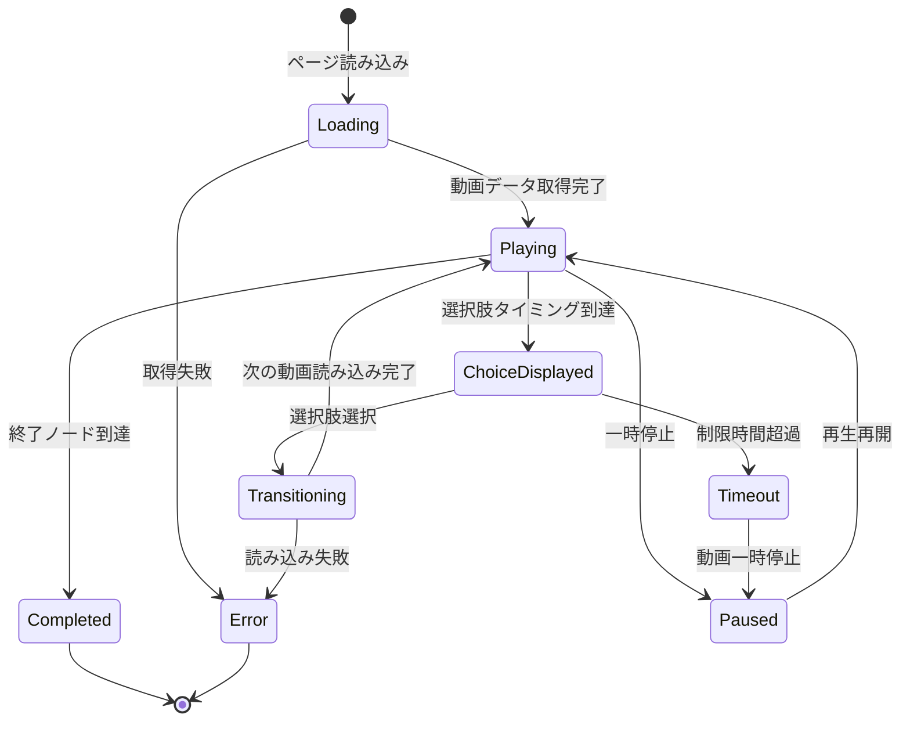
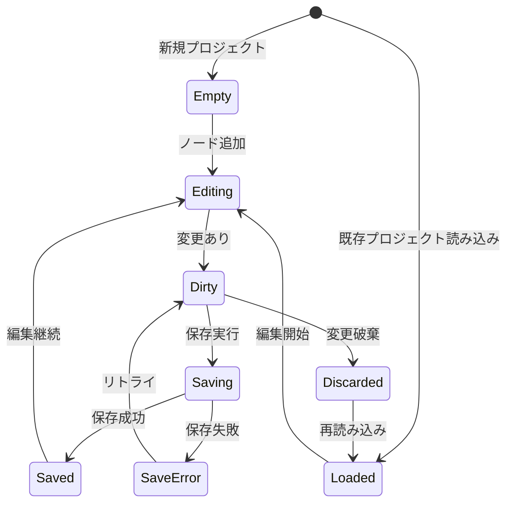

# フロントエンド技術設計書: インタラクティブ動画プラットフォーム

## メタ情報

| 項目 | 内容 |
|------|------|
| ドキュメントID | DESIGN-FE-2026-001 |
| バージョン | 1.1.0 |
| 作成日 | 2026-01-14 |
| 最終更新日 | 2026-01-14 |
| ステータス | Draft |
| 対応PRD | PRD-2026-001 |
| 複雑度レベル | High |

### 複雑度の根拠

1. **要件/AC観点**: 動画再生・選択肢オーバーレイ・分岐遷移・タイマー制御など、複数の非同期処理が連携する複雑なユーザー体験。管理画面のフローチャートエディタは高度なインタラクションを要求。
2. **制約/リスク観点**: 動画読み込み3秒以内、選択肢表示0.5秒以内、分岐遷移2秒以内のパフォーマンス要件。レスポンシブ対応（320px〜）と複数ブラウザ対応。

---

## 1. 合意事項チェックリスト

### スコープ

- [x] 視聴画面（動画プレイヤー、選択肢オーバーレイ、カウントダウンタイマー、分岐遷移）
- [x] 管理画面（フローチャートエディタ、動画アップロード、分岐設定）
- [x] 認証機能（ログイン、権限管理）
- [x] 進捗管理機能（完了ステータス、視聴履歴）

### 非スコープ

- [x] バックエンドAPI実装（別途設計書で対応）
- [x] 動画ストリーミング配信（プログレッシブダウンロードのみ）
- [x] クイズ・正解判定機能
- [x] 多言語対応
- [x] SCORM/外部LMS連携

### 制約

- [x] 対応ブラウザ: Chrome, Safari, Edge, Firefox（最新2バージョン）
- [x] 最小画面幅: 320px（iPhone SE対応）
- [x] 動画形式: MP4（H.264）のみ
- [x] 選択肢: 2択固定

### パフォーマンス要件

- [x] 動画読み込み時間: 初回再生開始まで3秒以内
- [x] 選択肢表示遅延: 指定タイミングから0.5秒以内
- [x] 分岐遷移時間: 選択から次の動画再生まで2秒以内
- [x] 同時接続数: 100ユーザー

### 設計への反映確認

| 合意事項 | 設計上の反映箇所 |
|----------|------------------|
| 視聴画面優先 | セクション6でVertical Sliceアプローチを採用 |
| 320px対応 | セクション5.5でレスポンシブ設計を定義 |
| 2択固定 | セクション9.2でChoiceオブジェクトを2要素配列で定義 |
| 3秒以内読み込み | セクション5.1で動画プリロード戦略を定義 |

---

## 2. 前提ADR・技術選定

### 2.1 技術スタック選定

| カテゴリ | 採用技術 | 選定理由 |
|----------|----------|----------|
| フレームワーク | Next.js 15 (App Router) | React Server Components対応、Vercelとの親和性、ISR/PPR対応 |
| UIコンポーネント | shadcn/ui + Radix UI | アクセシビリティ、カスタマイズ性、Tailwind CSS統合 |
| スタイリング | Tailwind CSS v4 | ユーティリティファースト、レスポンシブ対応が容易 |
| 状態管理 | Zustand | シンプルなAPI、軽量（約3KB）、プロバイダー不要 |
| サーバー状態 | TanStack Query | キャッシュ管理、楽観的更新、サーバー状態の分離 |
| 動画プレイヤー | react-player | 軽量、MP4対応、カスタマイズ容易 |
| フローチャート | React Flow | ノードベースUI標準、ドラッグ&ドロップ、高い拡張性 |
| フォーム | React Hook Form + Zod | 型安全なバリデーション、パフォーマンス最適化 |
| 認証 | NextAuth.js v5 | Next.js App Router対応、Credentials Provider |

### 2.2 NextAuth.js v5 リスク対策

> **注意**: NextAuth.js v5（Auth.js v5）は2026年1月時点でベータ版です。本番環境での採用に際し、以下のリスク対策を講じます。

#### リスク評価

| リスク項目 | 影響度 | 発生可能性 | 対策 |
|-----------|--------|-----------|------|
| 破壊的変更 | 中 | 中 | v4互換レイヤーの維持 |
| バグ・不具合 | 中 | 低〜中 | 認証統合テストの強化 |
| ドキュメント不足 | 低 | 中 | 公式Discord/GitHubでのサポート活用 |

#### フォールバック計画

1. **v4へのダウングレード手順**
   - `next-auth@4.x` への依存関係変更
   - `pages/api/auth/[...nextauth].ts` への移行（App Routerから Pages Router）
   - セッション管理コードの調整

2. **移行トリガー条件**
   - 認証フローで未解決のブロッキングバグが3件以上発生
   - v5正式リリースが6ヶ月以上遅延
   - セキュリティ脆弱性が発見され、パッチが1週間以上提供されない

#### 認証周りの統合テスト強化策

```typescript
// __tests__/integration/auth.test.ts
describe('認証統合テスト', () => {
  it('ログイン成功時にセッションが正しく作成される', async () => {})
  it('セッション期限切れで適切にリダイレクトされる', async () => {})
  it('不正なトークンでアクセス拒否される', async () => {})
  it('ログアウト後にセッションが完全に破棄される', async () => {})
  it('同時ログイン制限が正しく機能する', async () => {})
  it('CSRF保護が有効である', async () => {})
})
```

- **テスト実行頻度**: 毎日のCI/CDパイプラインで実行
- **監視項目**: 認証関連エラー率、セッション作成/破棄の成功率

### 2.3 ライブラリ選定の詳細比較

#### 動画プレイヤー選定

| 評価軸 | react-player | Video.js | Vidstack |
|--------|-------------|----------|----------|
| バンドルサイズ | 小（軽量） | 大 | 中 |
| MP4対応 | 良好 | 良好 | 良好 |
| カスタムUI | 容易 | プラグイン必要 | 容易 |
| React統合 | ネイティブ | ラッパー必要 | ネイティブ |
| メンテナンス | Muxが継続 | 活発 | 活発 |

**決定**: react-player を採用。軽量でReactとの統合が容易、Muxによるメンテナンス継続が保証されている。

#### 状態管理選定

| 評価軸 | Zustand | Jotai | Redux Toolkit |
|--------|---------|-------|---------------|
| 学習コスト | 低 | 中 | 高 |
| バンドルサイズ | 約3KB | 約3KB | 約40KB |
| ボイラープレート | 最小 | 最小 | 多い |
| DevTools | あり | あり | 充実 |
| プロバイダー | 不要 | 必要 | 必要 |

**決定**: Zustand を採用。シンプルなAPIでプロバイダー不要、動画再生状態やユーザー進捗の管理に適している。

#### フローチャートエディタ選定

| 評価軸 | React Flow | JointJS | GoJS |
|--------|-----------|---------|------|
| ライセンス | MIT | MPL/商用 | 商用 |
| React統合 | ネイティブ | ラッパー | ラッパー |
| カスタムノード | 容易 | 中程度 | 中程度 |
| コミュニティ | 活発 | 活発 | 活発 |
| 導入事例 | Stripe, Typeform | 多数 | 多数 |

**決定**: React Flow を採用。MITライセンス、Reactネイティブ、カスタムノードが容易。

---

## 3. 既存コードベース分析

### 3.1 現状

新規プロジェクトのため、既存コードベースは存在しない。

### 3.2 類似コンポーネント調査

該当なし（新規プロジェクト）。

### 3.3 採用決定

新規実装として進行。

---

## 4. アーキテクチャ設計

### 4.1 全体構成図



### 4.2 ディレクトリ構成

```
src/
├── app/                          # Next.js App Router
│   ├── (auth)/                   # 認証グループ
│   │   ├── login/
│   │   │   └── page.tsx
│   │   └── layout.tsx
│   ├── (viewer)/                 # 視聴者グループ
│   │   ├── watch/
│   │   │   └── [videoId]/
│   │   │       └── page.tsx
│   │   ├── progress/
│   │   │   └── page.tsx
│   │   └── layout.tsx
│   ├── (admin)/                  # 管理者グループ
│   │   ├── dashboard/
│   │   │   └── page.tsx
│   │   ├── editor/
│   │   │   └── [projectId]/
│   │   │       └── page.tsx
│   │   ├── upload/
│   │   │   └── page.tsx
│   │   └── layout.tsx
│   ├── api/                      # API Routes
│   │   └── auth/
│   │       └── [...nextauth]/
│   │           └── route.ts
│   ├── layout.tsx
│   └── page.tsx
├── components/
│   ├── ui/                       # shadcn/ui コンポーネント
│   │   ├── button.tsx
│   │   ├── card.tsx
│   │   ├── dialog.tsx
│   │   ├── input.tsx
│   │   ├── progress.tsx
│   │   └── ...
│   ├── video/                    # 動画関連コンポーネント
│   │   ├── VideoPlayer.tsx
│   │   ├── ChoiceOverlay.tsx
│   │   ├── CountdownTimer.tsx
│   │   ├── BranchTransition.tsx
│   │   └── VideoProgress.tsx
│   ├── editor/                   # フローチャートエディタ
│   │   ├── FlowEditor.tsx
│   │   ├── VideoNode.tsx
│   │   ├── ChoiceNode.tsx
│   │   ├── EndNode.tsx
│   │   ├── NodeToolbar.tsx
│   │   └── EdgeSettings.tsx
│   ├── upload/                   # アップロード関連
│   │   ├── VideoUploader.tsx
│   │   ├── UploadProgress.tsx
│   │   └── VideoPreview.tsx
│   ├── auth/                     # 認証関連
│   │   ├── LoginForm.tsx
│   │   └── AuthGuard.tsx
│   └── layout/                   # レイアウト
│       ├── Header.tsx
│       ├── Sidebar.tsx
│       └── Footer.tsx
├── hooks/                        # カスタムフック
│   ├── useVideoPlayer.ts
│   ├── useChoiceTimer.ts
│   ├── useBranchNavigation.ts
│   ├── useProgress.ts
│   └── useFlowEditor.ts
├── stores/                       # Zustand ストア
│   ├── videoStore.ts
│   ├── progressStore.ts
│   └── editorStore.ts
├── lib/                          # ユーティリティ
│   ├── api/
│   │   ├── client.ts
│   │   ├── videos.ts
│   │   ├── progress.ts
│   │   └── users.ts
│   ├── auth/
│   │   └── config.ts
│   └── utils/
│       ├── video.ts
│       └── time.ts
├── types/                        # 型定義
│   ├── video.ts
│   ├── branch.ts
│   ├── user.ts
│   └── progress.ts
└── styles/
    └── globals.css
```

### 4.3 コンポーネント階層図



---

## 5. コンポーネント詳細設計

### 5.1 視聴画面コンポーネント

#### VideoPlayer

動画再生とインタラクションを制御するメインコンポーネント。

```typescript
// types/video.ts
type VideoPlayerProps = {
  videoId: string
  initialNodeId: string
  onComplete: () => void
  onChoiceSelect: (choiceId: string, nodeId: string) => void
}

type VideoPlayerState = {
  currentNodeId: string
  isPlaying: boolean
  currentTime: number
  duration: number
  isChoiceVisible: boolean
  selectedChoice: string | null
}
```

```typescript
// components/video/VideoPlayer.tsx
'use client'

import { useCallback, useEffect, useRef, useState } from 'react'
import ReactPlayer from 'react-player'
import type { OnProgressProps } from 'react-player/base'

import { ChoiceOverlay } from './ChoiceOverlay'
import { BranchTransition } from './BranchTransition'
import { useVideoPlayer } from '@/hooks/useVideoPlayer'
import { useVideoStore } from '@/stores/videoStore'

type VideoPlayerProps = {
  videoId: string
  initialNodeId: string
  onComplete: () => void
  onChoiceSelect: (choiceId: string, nodeId: string) => void
}

export function VideoPlayer({
  videoId,
  initialNodeId,
  onComplete,
  onChoiceSelect,
}: VideoPlayerProps) {
  const playerRef = useRef<ReactPlayer>(null)
  const {
    currentNode,
    isChoiceTime,
    handleProgress,
    handleChoiceSelect,
    handleTransitionComplete,
  } = useVideoPlayer(videoId, initialNodeId)

  const { isTransitioning, setIsTransitioning } = useVideoStore()

  const handleVideoProgress = useCallback(
    (state: OnProgressProps) => {
      handleProgress(state.playedSeconds)
    },
    [handleProgress]
  )

  const handleChoice = useCallback(
    (choiceId: string) => {
      setIsTransitioning(true)
      handleChoiceSelect(choiceId)
      onChoiceSelect(choiceId, currentNode.id)
    },
    [currentNode.id, handleChoiceSelect, onChoiceSelect, setIsTransitioning]
  )

  if (isTransitioning) {
    return (
      <BranchTransition
        onComplete={handleTransitionComplete}
      />
    )
  }

  return (
    <div className="relative w-full aspect-video bg-black">
      <ReactPlayer
        ref={playerRef}
        url={currentNode.videoUrl}
        width="100%"
        height="100%"
        playing={!isChoiceTime}
        onProgress={handleVideoProgress}
        onEnded={onComplete}
        progressInterval={100}
      />

      {isChoiceTime && currentNode.choices && (
        <ChoiceOverlay
          choices={currentNode.choices}
          timeLimit={currentNode.timeLimit}
          onSelect={handleChoice}
          onTimeout={() => {
            // PRD要件: 制限時間超過時は動画を一時停止する
            // setIsPlaying(false) を明示的に呼び出し、再生を停止
            // handleChoiceは内部でsetIsTransitioning(true)を呼ぶため、
            // ここで明示的に停止状態を設定する必要がある
            handleChoice('timeout')
          }}
        />
      )}
    </div>
  )
}
```

#### ChoiceOverlay

選択肢を表示するオーバーレイコンポーネント。

```typescript
// components/video/ChoiceOverlay.tsx
'use client'

import { useCallback } from 'react'

import { Button } from '@/components/ui/button'
import { CountdownTimer } from './CountdownTimer'
import type { Choice } from '@/types/branch'

type ChoiceOverlayProps = {
  choices: Choice[]
  timeLimit: number
  onSelect: (choiceId: string) => void
  onTimeout: () => void
}

export function ChoiceOverlay({
  choices,
  timeLimit,
  onSelect,
  onTimeout,
}: ChoiceOverlayProps) {
  const handleSelect = useCallback(
    (choiceId: string) => {
      onSelect(choiceId)
    },
    [onSelect]
  )

  return (
    <div className="absolute inset-0 flex flex-col items-center justify-center bg-black/60">
      <CountdownTimer
        duration={timeLimit}
        onComplete={onTimeout}
        className="mb-8"
      />

      <div className="flex flex-col gap-4 w-full max-w-md px-4 sm:flex-row sm:gap-6">
        {choices.map((choice) => (
          <Button
            key={choice.id}
            onClick={() => handleSelect(choice.id)}
            size="lg"
            className="flex-1 h-16 text-lg font-semibold sm:h-20"
          >
            {choice.label}
          </Button>
        ))}
      </div>
    </div>
  )
}
```

#### CountdownTimer

カウントダウンタイマーコンポーネント。

```typescript
// components/video/CountdownTimer.tsx
'use client'

import { useEffect, useRef, useState } from 'react'
import { Progress } from '@/components/ui/progress'
import { cn } from '@/lib/utils'

type CountdownTimerProps = {
  duration: number
  onComplete: () => void
  className?: string
}

export function CountdownTimer({
  duration,
  onComplete,
  className,
}: CountdownTimerProps) {
  const [remainingTime, setRemainingTime] = useState(duration)
  const [progress, setProgress] = useState(100)

  // onCompleteをrefで保持し、依存配列からonCompleteを除外
  // これにより、親コンポーネントでonCompleteが再生成されても
  // タイマーがリセットされることを防ぐ
  const onCompleteRef = useRef(onComplete)
  useEffect(() => {
    onCompleteRef.current = onComplete
  }, [onComplete])

  useEffect(() => {
    if (remainingTime <= 0) {
      onCompleteRef.current()
      return
    }

    const interval = setInterval(() => {
      setRemainingTime((prev) => {
        const next = prev - 0.1
        setProgress((next / duration) * 100)
        return next
      })
    }, 100)

    return () => clearInterval(interval)
  }, [remainingTime, duration])  // onCompleteを依存配列から削除

  return (
    <div className={cn('w-full max-w-md', className)}>
      <div className="flex items-center justify-between mb-2">
        <span className="text-white text-sm">残り時間</span>
        <span className="text-white text-2xl font-bold tabular-nums">
          {Math.ceil(remainingTime)}秒
        </span>
      </div>
      <Progress
        value={progress}
        className="h-3"
        aria-label={`残り${Math.ceil(remainingTime)}秒`}
      />
    </div>
  )
}
```

### 5.2 管理画面コンポーネント

#### FlowEditor

フローチャートエディタのメインコンポーネント。

```typescript
// components/editor/FlowEditor.tsx
'use client'

import { useCallback, useMemo } from 'react'
import {
  ReactFlow,
  Controls,
  Background,
  MiniMap,
  addEdge,
  useNodesState,
  useEdgesState,
  type Connection,
  type Edge,
  type Node,
} from '@xyflow/react'
import '@xyflow/react/dist/style.css'

import { VideoNode } from './VideoNode'
import { ChoiceNode } from './ChoiceNode'
import { EndNode } from './EndNode'
import { NodeToolbar } from './NodeToolbar'
import { useFlowEditor } from '@/hooks/useFlowEditor'
import type { FlowData } from '@/types/branch'

type FlowEditorProps = {
  projectId: string
  initialData?: FlowData
  onSave: (data: FlowData) => void
}

const nodeTypes = {
  video: VideoNode,
  choice: ChoiceNode,
  end: EndNode,
}

export function FlowEditor({
  projectId,
  initialData,
  onSave,
}: FlowEditorProps) {
  const {
    nodes,
    edges,
    onNodesChange,
    onEdgesChange,
    onConnect,
    addVideoNode,
    addChoiceNode,
    addEndNode,
    deleteNode,
    updateNode,
  } = useFlowEditor(initialData)

  const handleConnect = useCallback(
    (params: Connection) => {
      onConnect(params)
    },
    [onConnect]
  )

  const handleSave = useCallback(() => {
    onSave({ nodes, edges })
  }, [nodes, edges, onSave])

  return (
    <div className="w-full h-[calc(100vh-4rem)]">
      <NodeToolbar
        onAddVideo={addVideoNode}
        onAddChoice={addChoiceNode}
        onAddEnd={addEndNode}
        onSave={handleSave}
      />

      <ReactFlow
        nodes={nodes}
        edges={edges}
        onNodesChange={onNodesChange}
        onEdgesChange={onEdgesChange}
        onConnect={handleConnect}
        nodeTypes={nodeTypes}
        fitView
      >
        <Controls />
        <Background />
        <MiniMap />
      </ReactFlow>
    </div>
  )
}
```

#### VideoNode

動画ノードのカスタムコンポーネント。

```typescript
// components/editor/VideoNode.tsx
'use client'

import { memo } from 'react'
import { Handle, Position, type NodeProps } from '@xyflow/react'

import { Card, CardContent, CardHeader, CardTitle } from '@/components/ui/card'
import { Button } from '@/components/ui/button'
import { PlayCircle, Settings } from 'lucide-react'
import type { VideoNodeData } from '@/types/branch'

type VideoNodeProps = NodeProps<VideoNodeData>

export const VideoNode = memo(function VideoNode({ data, selected }: VideoNodeProps) {
  return (
    <Card className={`w-64 ${selected ? 'ring-2 ring-primary' : ''}`}>
      <Handle type="target" position={Position.Top} />

      <CardHeader className="pb-2">
        <CardTitle className="flex items-center gap-2 text-sm">
          <PlayCircle className="h-4 w-4" />
          {data.label || '動画ノード'}
        </CardTitle>
      </CardHeader>

      <CardContent>
        {data.thumbnailUrl ? (
          
        ) : (
          <div className="w-full aspect-video bg-muted flex items-center justify-center rounded">
            <span className="text-muted-foreground text-xs">
              動画未設定
            </span>
          </div>
        )}

        <Button
          variant="ghost"
          size="sm"
          className="w-full mt-2"
          onClick={data.onEdit}
        >
          <Settings className="h-4 w-4 mr-2" />
          設定
        </Button>
      </CardContent>

      <Handle type="source" position={Position.Bottom} />
    </Card>
  )
})
```

### 5.3 アップロードコンポーネント

```typescript
// components/upload/VideoUploader.tsx
'use client'

import { useCallback, useState } from 'react'
import { useDropzone } from 'react-dropzone'

import { Card, CardContent } from '@/components/ui/card'
import { UploadProgress } from './UploadProgress'
import { VideoPreview } from './VideoPreview'
import { Upload, FileVideo } from 'lucide-react'

type VideoUploaderProps = {
  onUploadComplete: (url: string, metadata: VideoMetadata) => void
  maxSizeBytes?: number
}

type VideoMetadata = {
  filename: string
  duration: number
  width: number
  height: number
}

export function VideoUploader({
  onUploadComplete,
  maxSizeBytes = 500 * 1024 * 1024, // 500MB
}: VideoUploaderProps) {
  const [uploadProgress, setUploadProgress] = useState(0)
  const [isUploading, setIsUploading] = useState(false)
  const [previewUrl, setPreviewUrl] = useState<string | null>(null)
  const [error, setError] = useState<string | null>(null)

  const handleDrop = useCallback(
    async (acceptedFiles: File[]) => {
      const file = acceptedFiles[0]
      if (!file) return

      if (file.size > maxSizeBytes) {
        setError(`ファイルサイズが上限（${maxSizeBytes / 1024 / 1024}MB）を超えています`)
        return
      }

      if (!file.type.startsWith('video/mp4')) {
        setError('MP4形式のみアップロード可能です')
        return
      }

      setError(null)
      setIsUploading(true)
      setPreviewUrl(URL.createObjectURL(file))

      try {
        // アップロード処理（実装はAPI層で定義）
        const formData = new FormData()
        formData.append('file', file)

        const response = await fetch('/api/upload', {
          method: 'POST',
          body: formData,
        })

        if (!response.ok) {
          throw new Error('アップロードに失敗しました')
        }

        const data: unknown = await response.json()

        if (!isUploadResponse(data)) {
          throw new Error('不正なレスポンス形式')
        }

        onUploadComplete(data.url, data.metadata)
      } catch (err) {
        setError(err instanceof Error ? err.message : 'アップロードエラー')
      } finally {
        setIsUploading(false)
      }
    },
    [maxSizeBytes, onUploadComplete]
  )

  const { getRootProps, getInputProps, isDragActive } = useDropzone({
    onDrop: handleDrop,
    accept: { 'video/mp4': ['.mp4'] },
    maxFiles: 1,
  })

  return (
    <Card>
      <CardContent className="p-6">
        {previewUrl ? (
          <VideoPreview url={previewUrl} onRemove={() => setPreviewUrl(null)} />
        ) : (
          <div
            {...getRootProps()}
            className={`
              border-2 border-dashed rounded-lg p-8 text-center cursor-pointer
              transition-colors
              ${isDragActive ? 'border-primary bg-primary/5' : 'border-muted'}
            `}
          >
            <input {...getInputProps()} />
            <FileVideo className="h-12 w-12 mx-auto text-muted-foreground mb-4" />
            <p className="text-muted-foreground">
              {isDragActive
                ? 'ファイルをドロップしてください'
                : 'クリックまたはドラッグ&ドロップでMP4ファイルをアップロード'}
            </p>
            <p className="text-xs text-muted-foreground mt-2">
              最大 {maxSizeBytes / 1024 / 1024}MB
            </p>
          </div>
        )}

        {isUploading && (
          <UploadProgress progress={uploadProgress} className="mt-4" />
        )}

        {error && (
          <p className="text-destructive text-sm mt-4">{error}</p>
        )}
      </CardContent>
    </Card>
  )
}

// 型ガード
function isUploadResponse(data: unknown): data is { url: string; metadata: VideoMetadata } {
  return (
    typeof data === 'object' &&
    data !== null &&
    'url' in data &&
    typeof (data as { url: unknown }).url === 'string' &&
    'metadata' in data
  )
}
```

### 5.4 認証コンポーネント

```typescript
// components/auth/LoginForm.tsx
'use client'

import { useState } from 'react'
import { useForm } from 'react-hook-form'
import { zodResolver } from '@hookform/resolvers/zod'
import { z } from 'zod'
import { signIn } from 'next-auth/react'
import { useRouter } from 'next/navigation'

import { Button } from '@/components/ui/button'
import { Input } from '@/components/ui/input'
import { Card, CardContent, CardHeader, CardTitle } from '@/components/ui/card'
import {
  Form,
  FormControl,
  FormField,
  FormItem,
  FormLabel,
  FormMessage,
} from '@/components/ui/form'

const loginSchema = z.object({
  email: z.string().email('有効なメールアドレスを入力してください'),
  password: z.string().min(8, 'パスワードは8文字以上で入力してください'),
})

type LoginFormData = z.infer<typeof loginSchema>

export function LoginForm() {
  const router = useRouter()
  const [error, setError] = useState<string | null>(null)
  const [isLoading, setIsLoading] = useState(false)

  const form = useForm<LoginFormData>({
    resolver: zodResolver(loginSchema),
    defaultValues: {
      email: '',
      password: '',
    },
  })

  const onSubmit = async (data: LoginFormData) => {
    setIsLoading(true)
    setError(null)

    try {
      const result = await signIn('credentials', {
        email: data.email,
        password: data.password,
        redirect: false,
      })

      if (result?.error) {
        setError('メールアドレスまたはパスワードが正しくありません')
        return
      }

      router.push('/watch')
      router.refresh()
    } catch {
      setError('ログイン処理中にエラーが発生しました')
    } finally {
      setIsLoading(false)
    }
  }

  return (
    <Card className="w-full max-w-md">
      <CardHeader>
        <CardTitle className="text-center">ログイン</CardTitle>
      </CardHeader>
      <CardContent>
        <Form {...form}>
          <form onSubmit={form.handleSubmit(onSubmit)} className="space-y-4">
            <FormField
              control={form.control}
              name="email"
              render={({ field }) => (
                <FormItem>
                  <FormLabel>メールアドレス</FormLabel>
                  <FormControl>
                    <Input
                      type="email"
                      placeholder="example@company.com"
                      {...field}
                    />
                  </FormControl>
                  <FormMessage />
                </FormItem>
              )}
            />

            <FormField
              control={form.control}
              name="password"
              render={({ field }) => (
                <FormItem>
                  <FormLabel>パスワード</FormLabel>
                  <FormControl>
                    <Input
                      type="password"
                      placeholder="********"
                      {...field}
                    />
                  </FormControl>
                  <FormMessage />
                </FormItem>
              )}
            />

            {error && (
              <p className="text-destructive text-sm">{error}</p>
            )}

            <Button
              type="submit"
              className="w-full"
              disabled={isLoading}
            >
              {isLoading ? 'ログイン中...' : 'ログイン'}
            </Button>
          </form>
        </Form>
      </CardContent>
    </Card>
  )
}
```

### 5.5 レスポンシブ設計

#### ブレークポイント定義

| ブレークポイント | 幅 | 用途 |
|------------------|-----|------|
| xs | 320px〜 | iPhone SE |
| sm | 640px〜 | スマートフォン横向き |
| md | 768px〜 | タブレット |
| lg | 1024px〜 | デスクトップ |
| xl | 1280px〜 | 大画面デスクトップ |

#### 選択肢オーバーレイのレスポンシブ対応

```typescript
// components/video/ChoiceOverlay.tsx のスタイル部分

// モバイル（デフォルト）: 縦並び
// sm以上: 横並び
<div className="flex flex-col gap-4 w-full max-w-md px-4 sm:flex-row sm:gap-6">
  {choices.map((choice) => (
    <Button
      key={choice.id}
      onClick={() => handleSelect(choice.id)}
      size="lg"
      // モバイル: h-16、デスクトップ: h-20
      className="flex-1 h-16 text-lg font-semibold sm:h-20"
    >
      {choice.label}
    </Button>
  ))}
</div>
```

#### タッチ操作対応

- 選択肢ボタン: 最小タップ領域 48x48px
- 動画コントロール: タッチフレンドリーなサイズ
- スワイプジェスチャー: 不要（シンプルなタップ操作のみ）

---

## 6. 実装アプローチ

### 6.1 アプローチ選定

**Vertical Slice（垂直スライス）** を採用。

#### 選定理由

1. **PRDの優先度**: 視聴画面が最優先と明記
2. **早期価値提供**: 動画再生→選択肢→分岐の基本フローを早期に動作確認可能
3. **依存関係**: 管理画面は視聴画面のデータ構造に依存

### 6.2 実装フェーズ



### 6.3 フェーズ別検証レベル

| フェーズ | 検証レベル | 検証内容 |
|----------|-----------|----------|
| Phase 1 | L2（統合） | 動画再生から分岐完了までのE2Eフロー |
| Phase 2 | L2（統合） | ログインから権限別画面遷移 |
| Phase 3 | L2（統合） | フロー作成から保存・読み込み |
| Phase 4 | L1（単体） | 進捗データの記録・表示 |

---

## 7. 状態管理設計

### 7.1 ストア構成



### 7.2 Zustand ストア定義

```typescript
// stores/videoStore.ts
import { create } from 'zustand'
import { devtools } from 'zustand/middleware'

type VideoState = {
  // 状態
  currentNodeId: string | null
  isPlaying: boolean
  isChoiceVisible: boolean
  isTransitioning: boolean
  currentTime: number

  // アクション
  setCurrentNode: (nodeId: string) => void
  setIsPlaying: (playing: boolean) => void
  setIsChoiceVisible: (visible: boolean) => void
  setIsTransitioning: (transitioning: boolean) => void
  setCurrentTime: (time: number) => void
  reset: () => void
}

const initialState = {
  currentNodeId: null,
  isPlaying: false,
  isChoiceVisible: false,
  isTransitioning: false,
  currentTime: 0,
}

export const useVideoStore = create<VideoState>()(
  devtools(
    (set) => ({
      ...initialState,

      setCurrentNode: (nodeId) =>
        set({ currentNodeId: nodeId }, false, 'setCurrentNode'),

      setIsPlaying: (playing) =>
        set({ isPlaying: playing }, false, 'setIsPlaying'),

      setIsChoiceVisible: (visible) =>
        set({ isChoiceVisible: visible }, false, 'setIsChoiceVisible'),

      setIsTransitioning: (transitioning) =>
        set({ isTransitioning: transitioning }, false, 'setIsTransitioning'),

      setCurrentTime: (time) =>
        set({ currentTime: time }, false, 'setCurrentTime'),

      reset: () => set(initialState, false, 'reset'),
    }),
    { name: 'video-store' }
  )
)
```

```typescript
// stores/editorStore.ts
import { create } from 'zustand'
import { devtools } from 'zustand/middleware'
import type { Node, Edge } from '@xyflow/react'

type EditorState = {
  // 状態
  nodes: Node[]
  edges: Edge[]
  selectedNodeId: string | null
  isDirty: boolean

  // アクション
  setNodes: (nodes: Node[]) => void
  setEdges: (edges: Edge[]) => void
  setSelectedNode: (nodeId: string | null) => void
  setIsDirty: (dirty: boolean) => void
  addNode: (node: Node) => void
  updateNode: (nodeId: string, data: Partial<Node['data']>) => void
  deleteNode: (nodeId: string) => void
}

export const useEditorStore = create<EditorState>()(
  devtools(
    (set) => ({
      nodes: [],
      edges: [],
      selectedNodeId: null,
      isDirty: false,

      setNodes: (nodes) => set({ nodes, isDirty: true }),
      setEdges: (edges) => set({ edges, isDirty: true }),
      setSelectedNode: (nodeId) => set({ selectedNodeId: nodeId }),
      setIsDirty: (dirty) => set({ isDirty: dirty }),

      addNode: (node) =>
        set((state) => ({
          nodes: [...state.nodes, node],
          isDirty: true,
        })),

      updateNode: (nodeId, data) =>
        set((state) => ({
          nodes: state.nodes.map((node) =>
            node.id === nodeId
              ? { ...node, data: { ...node.data, ...data } }
              : node
          ),
          isDirty: true,
        })),

      deleteNode: (nodeId) =>
        set((state) => ({
          nodes: state.nodes.filter((node) => node.id !== nodeId),
          edges: state.edges.filter(
            (edge) => edge.source !== nodeId && edge.target !== nodeId
          ),
          isDirty: true,
        })),
    }),
    { name: 'editor-store' }
  )
)
```

### 7.3 TanStack Query 定義

```typescript
// lib/api/videos.ts
import { useQuery, useMutation, useQueryClient } from '@tanstack/react-query'
import type { VideoData, BranchData } from '@/types/video'

const videoKeys = {
  all: ['videos'] as const,
  detail: (id: string) => [...videoKeys.all, id] as const,
  branches: (id: string) => [...videoKeys.detail(id), 'branches'] as const,
}

export function useVideoQuery(videoId: string) {
  return useQuery({
    queryKey: videoKeys.detail(videoId),
    queryFn: async () => {
      const response = await fetch(`/api/videos/${videoId}`)
      if (!response.ok) {
        throw new Error('動画データの取得に失敗しました')
      }
      const data: unknown = await response.json()
      if (!isVideoData(data)) {
        throw new Error('不正なデータ形式')
      }
      return data
    },
  })
}

export function useBranchQuery(videoId: string) {
  return useQuery({
    queryKey: videoKeys.branches(videoId),
    queryFn: async () => {
      const response = await fetch(`/api/videos/${videoId}/branches`)
      if (!response.ok) {
        throw new Error('分岐データの取得に失敗しました')
      }
      const data: unknown = await response.json()
      if (!isBranchData(data)) {
        throw new Error('不正なデータ形式')
      }
      return data
    },
  })
}

// 型ガード
function isVideoData(data: unknown): data is VideoData {
  return (
    typeof data === 'object' &&
    data !== null &&
    'id' in data &&
    'title' in data &&
    'nodes' in data
  )
}

function isBranchData(data: unknown): data is BranchData {
  return (
    typeof data === 'object' &&
    data !== null &&
    'branches' in data &&
    Array.isArray((data as { branches: unknown }).branches)
  )
}
```

---

## 8. カスタムフック設計

### 8.1 useVideoPlayer

```typescript
// hooks/useVideoPlayer.ts
import { useCallback, useEffect, useMemo, useState } from 'react'
import { useVideoStore } from '@/stores/videoStore'
import { useBranchQuery } from '@/lib/api/videos'
import type { VideoNode, Choice } from '@/types/branch'

type UseVideoPlayerReturn = {
  currentNode: VideoNode
  isChoiceTime: boolean
  handleProgress: (playedSeconds: number) => void
  handleChoiceSelect: (choiceId: string) => void
  handleTransitionComplete: () => void
}

export function useVideoPlayer(
  videoId: string,
  initialNodeId: string
): UseVideoPlayerReturn {
  const { data: branchData } = useBranchQuery(videoId)
  const {
    currentNodeId,
    setCurrentNode,
    setIsChoiceVisible,
    setIsTransitioning,
    setIsPlaying,
  } = useVideoStore()

  const [isChoiceTime, setIsChoiceTime] = useState(false)

  // 初期化
  useEffect(() => {
    setCurrentNode(initialNodeId)
  }, [initialNodeId, setCurrentNode])

  // 現在のノードを取得
  const currentNode = useMemo(() => {
    if (!branchData || !currentNodeId) {
      return {
        id: '',
        videoUrl: '',
        choices: [],
        choiceTimestamp: 0,
        timeLimit: 10,
      }
    }
    return branchData.nodes.find((node) => node.id === currentNodeId) ?? {
      id: '',
      videoUrl: '',
      choices: [],
      choiceTimestamp: 0,
      timeLimit: 10,
    }
  }, [branchData, currentNodeId])

  // 再生進捗ハンドラ
  const handleProgress = useCallback(
    (playedSeconds: number) => {
      if (
        currentNode.choiceTimestamp > 0 &&
        playedSeconds >= currentNode.choiceTimestamp &&
        !isChoiceTime
      ) {
        setIsChoiceTime(true)
        setIsChoiceVisible(true)
        setIsPlaying(false)
      }
    },
    [currentNode.choiceTimestamp, isChoiceTime, setIsChoiceVisible, setIsPlaying]
  )

  // 選択肢選択ハンドラ
  const handleChoiceSelect = useCallback(
    (choiceId: string) => {
      const choice = currentNode.choices?.find((c) => c.id === choiceId)
      if (choice?.nextNodeId) {
        setIsTransitioning(true)
        setIsChoiceVisible(false)
        setIsChoiceTime(false)

        // 遅延して次のノードへ遷移
        setTimeout(() => {
          setCurrentNode(choice.nextNodeId)
        }, 500)
      }
    },
    [currentNode.choices, setCurrentNode, setIsTransitioning, setIsChoiceVisible]
  )

  // トランジション完了ハンドラ
  const handleTransitionComplete = useCallback(() => {
    setIsTransitioning(false)
    setIsPlaying(true)
  }, [setIsTransitioning, setIsPlaying])

  return {
    currentNode,
    isChoiceTime,
    handleProgress,
    handleChoiceSelect,
    handleTransitionComplete,
  }
}
```

### 8.2 useChoiceTimer

```typescript
// hooks/useChoiceTimer.ts
import { useCallback, useEffect, useRef, useState } from 'react'

type UseChoiceTimerProps = {
  duration: number
  onComplete: () => void
  isActive: boolean
}

type UseChoiceTimerReturn = {
  remainingTime: number
  progress: number
  reset: () => void
  pause: () => void
  resume: () => void
}

export function useChoiceTimer({
  duration,
  onComplete,
  isActive,
}: UseChoiceTimerProps): UseChoiceTimerReturn {
  const [remainingTime, setRemainingTime] = useState(duration)
  const [isPaused, setIsPaused] = useState(false)
  const intervalRef = useRef<NodeJS.Timeout | null>(null)
  const onCompleteRef = useRef(onComplete)

  // コールバックの最新化
  useEffect(() => {
    onCompleteRef.current = onComplete
  }, [onComplete])

  // タイマー処理
  useEffect(() => {
    if (!isActive || isPaused) {
      return
    }

    intervalRef.current = setInterval(() => {
      setRemainingTime((prev) => {
        const next = prev - 0.1
        if (next <= 0) {
          onCompleteRef.current()
          return 0
        }
        return next
      })
    }, 100)

    return () => {
      if (intervalRef.current) {
        clearInterval(intervalRef.current)
      }
    }
  }, [isActive, isPaused])

  const reset = useCallback(() => {
    setRemainingTime(duration)
  }, [duration])

  const pause = useCallback(() => {
    setIsPaused(true)
  }, [])

  const resume = useCallback(() => {
    setIsPaused(false)
  }, [])

  const progress = (remainingTime / duration) * 100

  return {
    remainingTime,
    progress,
    reset,
    pause,
    resume,
  }
}
```

### 8.3 useFlowEditor

```typescript
// hooks/useFlowEditor.ts
import { useCallback } from 'react'
import {
  useNodesState,
  useEdgesState,
  addEdge,
  type Connection,
  type Node,
  type Edge,
} from '@xyflow/react'
import { useEditorStore } from '@/stores/editorStore'
import type { FlowData, VideoNodeData, ChoiceNodeData } from '@/types/branch'

type UseFlowEditorReturn = {
  nodes: Node[]
  edges: Edge[]
  onNodesChange: (changes: unknown) => void
  onEdgesChange: (changes: unknown) => void
  onConnect: (params: Connection) => void
  addVideoNode: () => void
  addChoiceNode: () => void
  addEndNode: () => void
  deleteNode: (nodeId: string) => void
  updateNode: (nodeId: string, data: Partial<VideoNodeData | ChoiceNodeData>) => void
}

export function useFlowEditor(initialData?: FlowData): UseFlowEditorReturn {
  const [nodes, setNodes, onNodesChange] = useNodesState(initialData?.nodes ?? [])
  const [edges, setEdges, onEdgesChange] = useEdgesState(initialData?.edges ?? [])
  const { setIsDirty } = useEditorStore()

  const onConnect = useCallback(
    (params: Connection) => {
      setEdges((eds) => addEdge(params, eds))
      setIsDirty(true)
    },
    [setEdges, setIsDirty]
  )

  const generateId = () => `node_${Date.now()}`

  const addVideoNode = useCallback(() => {
    const newNode: Node<VideoNodeData> = {
      id: generateId(),
      type: 'video',
      position: { x: 250, y: 100 },
      data: {
        label: '新規動画',
        videoUrl: '',
        thumbnailUrl: '',
        onEdit: () => {},
      },
    }
    setNodes((nds) => [...nds, newNode])
    setIsDirty(true)
  }, [setNodes, setIsDirty])

  const addChoiceNode = useCallback(() => {
    const newNode: Node<ChoiceNodeData> = {
      id: generateId(),
      type: 'choice',
      position: { x: 250, y: 200 },
      data: {
        label: '選択肢',
        choices: [
          { id: 'a', label: '選択A', nextNodeId: '' },
          { id: 'b', label: '選択B', nextNodeId: '' },
        ],
        timeLimit: 10,
      },
    }
    setNodes((nds) => [...nds, newNode])
    setIsDirty(true)
  }, [setNodes, setIsDirty])

  const addEndNode = useCallback(() => {
    const newNode: Node = {
      id: generateId(),
      type: 'end',
      position: { x: 250, y: 300 },
      data: { label: '終了' },
    }
    setNodes((nds) => [...nds, newNode])
    setIsDirty(true)
  }, [setNodes, setIsDirty])

  const deleteNode = useCallback(
    (nodeId: string) => {
      setNodes((nds) => nds.filter((node) => node.id !== nodeId))
      setEdges((eds) =>
        eds.filter((edge) => edge.source !== nodeId && edge.target !== nodeId)
      )
      setIsDirty(true)
    },
    [setNodes, setEdges, setIsDirty]
  )

  const updateNode = useCallback(
    (nodeId: string, data: Partial<VideoNodeData | ChoiceNodeData>) => {
      setNodes((nds) =>
        nds.map((node) =>
          node.id === nodeId
            ? { ...node, data: { ...node.data, ...data } }
            : node
        )
      )
      setIsDirty(true)
    },
    [setNodes, setIsDirty]
  )

  return {
    nodes,
    edges,
    onNodesChange,
    onEdgesChange,
    onConnect,
    addVideoNode,
    addChoiceNode,
    addEndNode,
    deleteNode,
    updateNode,
  }
}
```

---

## 9. データモデル（フロントエンド型定義）

### 9.1 動画コンテンツ

```typescript
// types/video.ts

/** 動画プロジェクト */
export type VideoProject = {
  id: string
  title: string
  description: string
  thumbnailUrl: string
  status: 'draft' | 'published' | 'archived'
  createdAt: string
  updatedAt: string
  createdBy: string
}

/** 動画データ */
export type VideoData = {
  id: string
  title: string
  description: string                              // 追加: 動画の説明文
  thumbnailUrl: string | null                      // 追加: サムネイルURL（null許容）
  status: 'draft' | 'published' | 'archived'       // 追加: 公開ステータス
  nodes: VideoNode[]
  startNodeId: string | null                       // null許容に変更: 初期状態ではnull
  createdAt: string
  updatedAt: string
  createdBy: { id: string; name: string }          // 追加: 作成者情報
}

/** 動画ノード */
export type VideoNode = {
  id: string
  videoUrl: string
  thumbnailUrl?: string
  duration: number | null                          // null許容に変更: 未設定時はnull
  choiceTimestamp: number | null                   // null許容に変更: 終了ノードではnull
  timeLimit: number                                // 制限時間（秒）
  choices?: Choice[]
  isEndNode: boolean
  position: { x: number; y: number }               // 追加: フローエディタ上の座標
}
```

### 9.2 分岐ポイント・選択肢

```typescript
// types/branch.ts

/** 動画ノードデータ（分岐ノード用） */
export type VideoNodeData = {
  videoUrl: string
  thumbnailUrl?: string
  duration: number | null
  choiceTimestamp: number | null
  timeLimit: number
}

/** 選択肢ノードデータ（分岐ノード用） */
export type ChoiceNodeData = {
  choices: Choice[]
  timeLimit: number
}

/** 終了ノードデータ（分岐ノード用） */
export type EndNodeData = {
  message?: string
}

/** 分岐ノード（汎用） */
export type BranchNode = {
  id: string
  type: 'video' | 'choice' | 'end'
  label: string
  position: { x: number; y: number }
  data: VideoNodeData | ChoiceNodeData | EndNodeData
}

/** 分岐データ */
export type BranchData = {
  videoId: string
  nodes: BranchNode[]                              // VideoNode[]からBranchNode[]に変更
  edges: BranchEdge[]
}

/** 分岐エッジ */
export type BranchEdge = {
  id: string
  sourceNodeId: string
  targetNodeId: string
  choiceId: string
}

/** 選択肢（2択固定） */
export type Choice = {
  id: string
  label: string
  nextNodeId: string
}

/** フローデータ（React Flow用） */
export type FlowData = {
  nodes: import('@xyflow/react').Node[]
  edges: import('@xyflow/react').Edge[]
}

/** 動画ノードデータ（React Flow UI用） */
export type FlowVideoNodeData = {
  label: string
  videoUrl: string
  thumbnailUrl: string
  duration?: number | null
  choiceTimestamp?: number | null
  onEdit: () => void
}

/** 選択肢ノードデータ（React Flow UI用） */
export type FlowChoiceNodeData = {
  label: string
  choices: Choice[]
  timeLimit: number
}

/** 終了ノードデータ（React Flow UI用） */
export type FlowEndNodeData = {
  label: string
  message?: string
}
```

### 9.3 ユーザー進捗

```typescript
// types/progress.ts

/** ユーザー進捗 */
export type UserProgress = {
  userId: string
  videoId: string
  status: 'not_started' | 'in_progress' | 'completed'
  currentNodeId: string | null
  watchedNodeIds: string[]
  choiceHistory: ChoiceRecord[]
  totalWatchTime: number // 秒
  startedAt: string | null
  completedAt: string | null
  lastAccessedAt: string
}

/** 選択履歴 */
export type ChoiceRecord = {
  nodeId: string
  choiceId: string
  selectedAt: string
  timeSpent: number // 選択にかかった時間（秒）
  isTimeout: boolean
}

/** 進捗サマリー（管理者ダッシュボード用） */
export type ProgressSummary = {
  totalUsers: number
  completedUsers: number
  inProgressUsers: number
  notStartedUsers: number
  averageWatchTime: number
  completionRate: number
}
```

### 9.4 ユーザー

```typescript
// types/user.ts

/** ユーザー */
export type User = {
  id: string
  email: string
  name: string
  role: 'admin' | 'viewer'
  createdAt: string
  lastLoginAt: string | null
}

/** セッション */
export type Session = {
  user: User
  expires: string
}
```

---

## 10. 変更影響マップ

新規プロジェクトのため、既存コードへの影響はなし。

### 10.1 依存関係マップ



---

## 11. 統合境界契約

### 11.1 コンポーネント統合ポイント

#### VideoPlayer - ChoiceOverlay

```yaml
境界名: VideoPlayer → ChoiceOverlay
  入力(Props):
    choices: Choice[]
    timeLimit: number
    onSelect: (choiceId: string) => void
    onTimeout: () => void
  出力(Events):
    onSelect: 選択肢ID
    onTimeout: タイムアウト発生
  エラー時: 親コンポーネントでエラーステートを管理
```

#### FlowEditor - VideoNode

```yaml
境界名: FlowEditor → VideoNode
  入力(Props):
    data: VideoNodeData
    selected: boolean
  出力(Events):
    data.onEdit: 編集ボタンクリック
  エラー時: ノード内でエラー表示
```

### 11.2 API統合ポイント

#### フロントエンド - バックエンドAPI

```yaml
境界名: TanStack Query → Backend API
  入力: HTTPリクエスト（GET/POST/PUT/DELETE）
  出力: JSONレスポンス + 型ガードによる検証
  エラー時:
    - ネットワークエラー: リトライ機構（3回まで）
    - 400系エラー: ユーザーへのエラーメッセージ表示
    - 500系エラー: 汎用エラー画面へ遷移
```

#### フロントエンド - 動画ストレージ

```yaml
境界名: VideoPlayer → S3
  入力: 動画URL（署名付きURL）
  出力: MP4ストリーム
  エラー時:
    - 404: 「動画が見つかりません」表示
    - ネットワークエラー: リトライ + エラー表示
```

---

## 12. 状態遷移図

### 12.1 視聴画面の状態遷移



### 12.2 フローエディタの状態遷移



---

## 13. エラーハンドリング戦略

### 13.1 Error Boundary 構成

```typescript
// components/ErrorBoundary.tsx
'use client'

import { Component, type ReactNode } from 'react'
import { Button } from '@/components/ui/button'
import { Card, CardContent, CardHeader, CardTitle } from '@/components/ui/card'

type ErrorBoundaryProps = {
  children: ReactNode
  fallback?: ReactNode
}

type ErrorBoundaryState = {
  hasError: boolean
  error: Error | null
}

export class ErrorBoundary extends Component<ErrorBoundaryProps, ErrorBoundaryState> {
  constructor(props: ErrorBoundaryProps) {
    super(props)
    this.state = { hasError: false, error: null }
  }

  static getDerivedStateFromError(error: Error): ErrorBoundaryState {
    return { hasError: true, error }
  }

  handleRetry = () => {
    this.setState({ hasError: false, error: null })
  }

  render() {
    if (this.state.hasError) {
      if (this.props.fallback) {
        return this.props.fallback
      }

      return (
        <Card className="max-w-md mx-auto mt-8">
          <CardHeader>
            <CardTitle className="text-destructive">
              エラーが発生しました
            </CardTitle>
          </CardHeader>
          <CardContent>
            <p className="text-muted-foreground mb-4">
              {this.state.error?.message ?? '予期しないエラーが発生しました'}
            </p>
            <Button onClick={this.handleRetry}>
              再試行
            </Button>
          </CardContent>
        </Card>
      )
    }

    return this.props.children
  }
}
```

### 13.2 エラーハンドリングパターン

| エラー種別 | 対応方法 | ユーザー通知 |
|-----------|----------|-------------|
| 動画読み込み失敗 | リトライ（3回） | 「動画を読み込めませんでした」 |
| API通信エラー | TanStack Queryリトライ | トースト通知 |
| 認証エラー | ログインページへリダイレクト | 「セッションが切れました」 |
| バリデーションエラー | フォームフィールドにエラー表示 | インライン表示 |
| 予期しないエラー | Error Boundary | 汎用エラー画面 |

### 13.3 失敗シナリオとフォールバック

本セクションでは、システム障害時の対応策を定義します。

#### 13.3.1 動画ストレージ障害時のフォールバック

```typescript
// hooks/useVideoFallback.ts
import { useState, useCallback } from 'react'

type FallbackConfig = {
  primaryUrl: string
  fallbackUrl?: string
  placeholderUrl: string
}

export function useVideoFallback({ primaryUrl, fallbackUrl, placeholderUrl }: FallbackConfig) {
  const [currentUrl, setCurrentUrl] = useState(primaryUrl)
  const [attemptCount, setAttemptCount] = useState(0)
  const [errorState, setErrorState] = useState<'none' | 'retrying' | 'fallback' | 'failed'>('none')

  const handleError = useCallback(() => {
    if (attemptCount < 3) {
      // リトライ
      setAttemptCount((prev) => prev + 1)
      setErrorState('retrying')
      setTimeout(() => setCurrentUrl(`${primaryUrl}?retry=${attemptCount + 1}`), 1000)
    } else if (fallbackUrl && currentUrl !== fallbackUrl) {
      // フォールバックURLへ切り替え
      setCurrentUrl(fallbackUrl)
      setErrorState('fallback')
    } else {
      // 最終的に失敗
      setCurrentUrl(placeholderUrl)
      setErrorState('failed')
    }
  }, [attemptCount, primaryUrl, fallbackUrl, placeholderUrl, currentUrl])

  return { currentUrl, errorState, handleError }
}
```

**フォールバック戦略**:
1. S3プライマリリージョン障害 → CDNキャッシュからの配信
2. CDN障害 → S3セカンダリリージョンへのフォールバック
3. 全面障害 → プレースホルダー画像 + エラーメッセージ表示

#### 13.3.2 100同時接続時のパフォーマンス劣化ポイント

| 劣化ポイント | 影響 | 対策 |
|-------------|------|------|
| API応答遅延 | 選択肢表示が0.5秒を超える | クライアントキャッシュ活用、楽観的UI更新 |
| 動画読み込み | 3秒以内の初回再生が困難 | アダプティブビットレート、プリロード最適化 |
| WebSocket接続 | 進捗同期の遅延 | ポーリングへのフォールバック、バッチ送信 |
| メモリ使用量 | ブラウザ側でメモリ不足 | 不要なノードのアンマウント、動画キャッシュ制限 |

```typescript
// 負荷状況に応じた動的調整
const useAdaptivePerformance = () => {
  const [performanceMode, setPerformanceMode] = useState<'normal' | 'degraded'>('normal')

  useEffect(() => {
    // API応答時間を監視
    const checkPerformance = async () => {
      const start = Date.now()
      await fetch('/api/health')
      const latency = Date.now() - start

      if (latency > 500) {
        setPerformanceMode('degraded')
      } else {
        setPerformanceMode('normal')
      }
    }

    const interval = setInterval(checkPerformance, 30000)
    return () => clearInterval(interval)
  }, [])

  return performanceMode
}
```

#### 13.3.3 認証サービス障害時のグレースフルデグラデーション

```typescript
// lib/auth/graceful-degradation.ts

type AuthFallbackStrategy = {
  // 認証サービス障害時の動作モード
  mode: 'full_access' | 'read_only' | 'cached_session' | 'maintenance'
  message: string
  allowedActions: string[]
}

export const AUTH_FALLBACK_STRATEGIES: Record<string, AuthFallbackStrategy> = {
  // セッション検証API障害
  session_validation_failure: {
    mode: 'cached_session',
    message: '一時的に認証サーバーに接続できません。キャッシュされたセッションで継続します。',
    allowedActions: ['view_video', 'select_choice'],
  },
  // 認証サービス完全停止
  auth_service_down: {
    mode: 'read_only',
    message: 'メンテナンス中のため、一部機能が制限されています。',
    allowedActions: ['view_video'],
  },
  // 長時間障害
  extended_outage: {
    mode: 'maintenance',
    message: 'システムメンテナンス中です。しばらくお待ちください。',
    allowedActions: [],
  },
}
```

**グレースフルデグラデーション手順**:
1. **30秒以内の障害**: キャッシュされたセッションで継続、バックグラウンドでリトライ
2. **30秒〜5分の障害**: 読み取り専用モードへ移行、新規ログイン不可
3. **5分以上の障害**: メンテナンスページ表示

#### 13.3.4 低速ネットワークでの選択肢表示遅延対策

```typescript
// components/video/ChoiceOverlay.tsx の拡張

type NetworkAwareChoiceOverlayProps = {
  choices: Choice[]
  timeLimit: number
  onSelect: (choiceId: string) => void
  onTimeout: () => void
  // 低速ネットワーク対応
  networkQuality: 'good' | 'slow' | 'offline'
}

export function NetworkAwareChoiceOverlay({
  choices,
  timeLimit,
  onSelect,
  onTimeout,
  networkQuality,
}: NetworkAwareChoiceOverlayProps) {
  // 低速ネットワーク時は選択肢をプリレンダリング
  const adjustedTimeLimit = networkQuality === 'slow' ? timeLimit + 2 : timeLimit

  // オフライン時の処理
  if (networkQuality === 'offline') {
    return (
      <div className="absolute inset-0 flex items-center justify-center bg-black/80">
        <div className="text-white text-center">
          <p>ネットワーク接続を確認してください</p>
          <p className="text-sm text-muted-foreground mt-2">
            接続が回復すると自動的に再開します
          </p>
        </div>
      </div>
    )
  }

  return (
    <ChoiceOverlay
      choices={choices}
      timeLimit={adjustedTimeLimit}
      onSelect={onSelect}
      onTimeout={onTimeout}
    />
  )
}
```

**対策まとめ**:
| ネットワーク状態 | 対策 |
|-----------------|------|
| 良好（<100ms） | 通常動作 |
| 低速（100-500ms） | 制限時間+2秒、選択肢プリロード |
| 非常に低速（>500ms） | 選択肢をスケルトン表示で先行描画、制限時間+5秒 |
| オフライン | 再接続待機画面、ローカルキャッシュからの再開 |

---

## 14. テスト戦略

### 14.1 テスト構成

| テスト種別 | ツール | 対象 |
|-----------|--------|------|
| 単体テスト | Vitest | カスタムフック、ユーティリティ |
| コンポーネントテスト | Testing Library | UIコンポーネント |
| 統合テスト | Playwright | E2Eフロー |
| ビジュアルテスト | Storybook | コンポーネントカタログ |

### 14.2 主要テストケース

#### 視聴画面

```typescript
// __tests__/components/video/VideoPlayer.test.tsx
import { render, screen, waitFor } from '@testing-library/react'
import userEvent from '@testing-library/user-event'
import { VideoPlayer } from '@/components/video/VideoPlayer'

describe('VideoPlayer', () => {
  it('動画が正常に再生される', async () => {
    render(
      <VideoPlayer
        videoId="test-1"
        initialNodeId="node-1"
        onComplete={vi.fn()}
        onChoiceSelect={vi.fn()}
      />
    )

    await waitFor(() => {
      expect(screen.getByRole('video')).toBeInTheDocument()
    })
  })

  it('選択肢タイミングで選択肢が表示される', async () => {
    // ...
  })

  it('選択肢を選択すると次の動画に遷移する', async () => {
    // ...
  })

  it('制限時間超過で動画が一時停止する', async () => {
    // ...
  })
})
```

#### フローエディタ

```typescript
// __tests__/components/editor/FlowEditor.test.tsx
import { render, screen } from '@testing-library/react'
import userEvent from '@testing-library/user-event'
import { FlowEditor } from '@/components/editor/FlowEditor'

describe('FlowEditor', () => {
  it('動画ノードを追加できる', async () => {
    const user = userEvent.setup()
    render(<FlowEditor projectId="test-1" onSave={vi.fn()} />)

    await user.click(screen.getByRole('button', { name: '動画追加' }))

    expect(screen.getByText('新規動画')).toBeInTheDocument()
  })

  it('ノード間を接続できる', async () => {
    // ...
  })

  it('保存ボタンでonSaveが呼ばれる', async () => {
    // ...
  })
})
```

---

## 15. 受入条件（Acceptance Criteria）

### 15.1 視聴画面

| ID | 受入条件 | 検証方法 |
|----|---------|----------|
| AC-V-001 | MP4動画がブラウザで再生される | 動画再生テスト |
| AC-V-002 | 指定タイミングで2つの選択肢がオーバーレイ表示される | タイムスタンプ検証 |
| AC-V-003 | カウントダウンタイマーが表示され、残り時間が減少する | タイマー動作テスト |
| AC-V-004 | 選択肢を選ぶと対応する動画に遷移する | 分岐テスト |
| AC-V-005 | 制限時間超過で動画が一時停止する | タイムアウトテスト |
| AC-V-006 | 320px幅で選択肢が縦並びになる | レスポンシブテスト |
| AC-V-007 | 選択から次の動画再生まで2秒以内 | パフォーマンステスト |

### 15.2 管理画面

| ID | 受入条件 | 検証方法 |
|----|---------|----------|
| AC-A-001 | フローチャート上でノードをドラッグ&ドロップできる | 操作テスト |
| AC-A-002 | ノード間を線で接続できる | 接続テスト |
| AC-A-003 | MP4ファイルをアップロードできる | アップロードテスト |
| AC-A-004 | 各動画に選択肢テキストと制限時間を設定できる | 設定テスト |
| AC-A-005 | プレビューで動画フローを確認できる | プレビューテスト |

### 15.3 認証・権限

| ID | 受入条件 | 検証方法 |
|----|---------|----------|
| AC-AUTH-001 | メール/パスワードでログインできる | ログインテスト |
| AC-AUTH-002 | 管理者は管理画面にアクセスできる | 権限テスト |
| AC-AUTH-003 | 視聴者は管理画面にアクセスできない | 権限テスト |
| AC-AUTH-004 | 8時間でセッションがタイムアウトする | セッションテスト |

---

## 16. パフォーマンス最適化

### 16.1 動画プリロード戦略

```typescript
// hooks/useVideoPreload.ts
import { useEffect } from 'react'

type PreloadConfig = {
  currentNodeId: string
  nextNodeIds: string[]
  videoUrls: Map<string, string>
}

export function useVideoPreload({ currentNodeId, nextNodeIds, videoUrls }: PreloadConfig) {
  useEffect(() => {
    // 次の候補動画をプリロード
    nextNodeIds.forEach((nodeId) => {
      const url = videoUrls.get(nodeId)
      if (url) {
        const link = document.createElement('link')
        link.rel = 'preload'
        link.as = 'video'
        link.href = url
        document.head.appendChild(link)
      }
    })

    return () => {
      // クリーンアップ
      document.querySelectorAll('link[rel="preload"][as="video"]').forEach((el) => {
        el.remove()
      })
    }
  }, [currentNodeId, nextNodeIds, videoUrls])
}
```

### 16.2 レンダリング最適化

- **React.memo**: VideoNode, ChoiceNodeなどの頻繁に再レンダリングされないコンポーネント
- **useMemo/useCallback**: 計算コストの高い処理、イベントハンドラ
- **Code Splitting**: 動的インポートによる管理画面の分離

```typescript
// app/(admin)/editor/[projectId]/page.tsx
import dynamic from 'next/dynamic'

const FlowEditor = dynamic(
  () => import('@/components/editor/FlowEditor').then((mod) => mod.FlowEditor),
  {
    loading: () => <div>エディタを読み込み中...</div>,
    ssr: false, // React Flowはクライアントのみ
  }
)
```

---

## 17. アクセシビリティ対応

### 17.1 WCAG 2.1 AA 準拠項目

| 項目 | 対応方法 |
|------|----------|
| キーボード操作 | フォーカス管理、Tabキー移動 |
| スクリーンリーダー | aria-label, aria-live |
| 色コントラスト | Tailwind CSSのcontrast設定 |
| フォーカス表示 | focus-visible スタイル |

### 17.2 実装例

```typescript
// 選択肢ボタンのアクセシビリティ
<Button
  onClick={() => handleSelect(choice.id)}
  aria-label={`選択肢: ${choice.label}`}
  className="focus-visible:ring-2 focus-visible:ring-primary focus-visible:ring-offset-2"
>
  {choice.label}
</Button>

// カウントダウンのライブリージョン
<div
  role="timer"
  aria-live="polite"
  aria-label={`残り${Math.ceil(remainingTime)}秒`}
>
  {Math.ceil(remainingTime)}秒
</div>
```

---

## 18. セキュリティ考慮事項

### 18.1 フロントエンドセキュリティ

| 項目 | 対策 |
|------|------|
| XSS | React自動エスケープ、dangerouslySetInnerHTML不使用 |
| CSRF | NextAuth.js CSRFトークン |
| 認証 | サーバーサイドでのセッション検証 |
| 環境変数 | NEXT_PUBLIC_プレフィックスのみクライアント公開 |

### 18.2 動画URLの保護

```typescript
// 署名付きURLの使用（バックエンドで生成）
// フロントエンドでは直接S3 URLを公開しない

// lib/api/videos.ts
export async function getVideoUrl(videoId: string): Promise<string> {
  const response = await fetch(`/api/videos/${videoId}/signed-url`)
  const data = await response.json()
  return data.signedUrl // 有効期限付きURL
}
```

---

## 19. 参考資料

### Next.js / React

- [Next.js App Router Documentation](https://nextjs.org/docs/app) - 公式ドキュメント
- [React Server Components Guide](https://nextjs.org/docs/app/getting-started/server-and-client-components) - Server/Client Components
- [Next.js Best Practices in 2025](https://www.raftlabs.com/blog/building-with-next-js-best-practices-and-benefits-for-performance-first-teams/) - パフォーマンスとアーキテクチャ
- [React & Next.js Modern Best Practices](https://strapi.io/blog/react-and-nextjs-in-2025-modern-best-practices) - 2025年のベストプラクティス

### 動画プレイヤー

- [The Best React Video Player Libraries of 2025](https://blog.croct.com/post/best-react-video-libraries) - ライブラリ比較
- [react-player npm](https://www.npmjs.com/package/react-player) - 公式パッケージ
- [Video.js and React Guide](https://videojs.org/guides/react/) - Video.js統合ガイド

### フローチャートエディタ

- [React Flow Documentation](https://reactflow.dev/) - 公式ドキュメント
- [React Flow Examples](https://reactflow.dev/examples) - 実装例
- [Top JavaScript Diagramming Libraries 2026](https://www.jointjs.com/blog/javascript-diagramming-libraries) - ライブラリ比較

### UIコンポーネント

- [shadcn/ui Documentation](https://ui.shadcn.com/) - 公式ドキュメント
- [Radix UI vs shadcn Comparison](https://workos.com/blog/what-is-the-difference-between-radix-and-shadcn-ui) - 違いの解説
- [React UI Libraries Comparison 2025](https://makersden.io/blog/react-ui-libs-2025-comparing-shadcn-radix-mantine-mui-chakra) - 包括的比較

### 状態管理

- [State Management in 2025](https://dev.to/hijazi313/state-management-in-2025-when-to-use-context-redux-zustand-or-jotai-2d2k) - 選択ガイド
- [Zustand vs Jotai Comparison](https://blog.openreplay.com/zustand-jotai-react-state-manager/) - 詳細比較
- [Zustand Official Documentation](https://zustand.docs.pmnd.rs/getting-started/comparison) - 公式比較ページ

---

## 変更履歴

| バージョン | 日付 | 変更内容 | 変更者 |
|------------|------|----------|--------|
| 1.0.0 | 2026-01-14 | 初版作成 | Frontend Technical Designer Agent |
| 1.1.0 | 2026-01-14 | CountdownTimerのuseEffect問題修正、NextAuth.js v5リスク対策追加、失敗シナリオ追加、データモデル型定義更新（バックエンド整合） | Claude |
