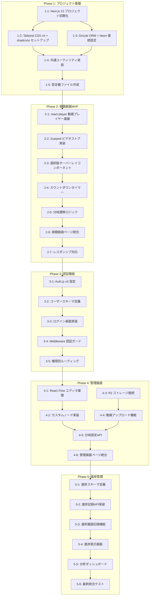
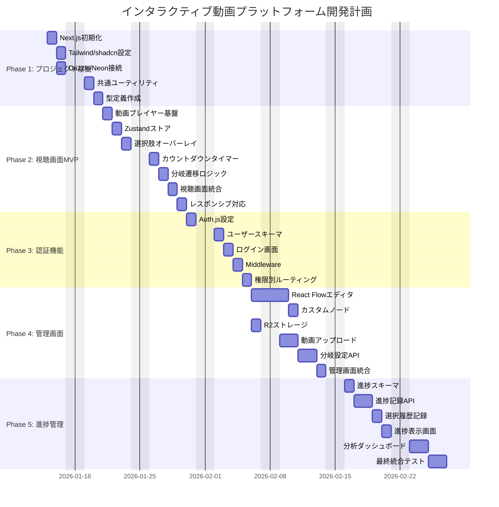

# 作業計画書: インタラクティブ動画プラットフォーム

## メタ情報

| 項目 | 内容 |
|------|------|
| ドキュメントID | PLAN-2026-001 |
| バージョン | 1.0.0 |
| 作成日 | 2026-01-14 |
| 最終更新日 | 2026-01-14 |
| ステータス | Draft |
| 対応PRD | PRD-2026-001 |
| 対応設計書 | DESIGN-FE-2026-001, DESIGN-BE-2026-001 |

---

## 1. 概要

### 1.1 プロジェクト目標

社内・チーム向け教育研修用のインタラクティブ動画プラットフォームの開発。視聴者が動画内で選択肢を選ぶことでストーリーが分岐し、能動的な学習体験を提供する。

### 1.2 開発優先度

1. **視聴画面（最優先）**: ユーザーが動画を視聴し、選択肢を選んで分岐する基本体験
2. **管理画面**: 管理者が動画をアップロードし、分岐を設定する機能
3. **進捗管理**: 完了ステータス、選択履歴、視聴時間の記録・表示

### 1.3 実装アプローチ

**Vertical Slice（垂直スライス）** を採用。視聴画面を優先し、各フェーズで動作検証可能な状態を維持。

---

## 2. フェーズ構成図

```mermaid
flowchart LR
    subgraph Phase1["Phase 1: プロジェクト基盤"]
        P1-1["Next.js初期化"]
        P1-2["基本ライブラリ導入"]
        P1-3["DB接続設定"]
        P1-4["ディレクトリ構成"]
    end

    subgraph Phase2["Phase 2: 視聴画面MVP"]
        P2-1["動画プレイヤー"]
        P2-2["選択肢オーバーレイ"]
        P2-3["タイマー"]
        P2-4["分岐遷移"]
    end

    subgraph Phase3["Phase 3: 認証機能"]
        P3-1["NextAuth設定"]
        P3-2["ログイン画面"]
        P3-3["権限管理"]
    end

    subgraph Phase4["Phase 4: 管理画面"]
        P4-1["フローチャートエディタ"]
        P4-2["動画アップロード"]
        P4-3["分岐設定"]
    end

    subgraph Phase5["Phase 5: 進捗管理"]
        P5-1["進捗記録API"]
        P5-2["進捗表示画面"]
        P5-3["分析ダッシュボード"]
    end

    Phase1 --> Phase2
    Phase2 --> Phase3
    Phase3 --> Phase4
    Phase4 --> Phase5
```



---

## 3. タスク依存関係図



---

## 4. Phase 1: プロジェクト基盤

### 4.1 概要

| 項目 | 内容 |
|------|------|
| 目標 | 開発基盤の構築と技術スタックの確立 |
| 期間 | 3日 |
| 検証レベル | L1（単体）: 各設定の動作確認 |

### 4.2 タスク詳細

#### タスク 1-1: Next.js 15 プロジェクト初期化

- [ ] **実装内容**
  - [ ] `npx create-next-app@latest` でプロジェクト作成（App Router有効）
  - [ ] TypeScript 設定（strict mode）
  - [ ] ESLint + Prettier 設定
  - [ ] .gitignore 設定

- **完了条件**
  - `npm run dev` でローカルサーバー起動
  - TypeScript コンパイルエラーなし
  - ESLint エラーなし

- **対応設計書**: DESIGN-FE-2026-001 セクション2.1

---

#### タスク 1-2: Tailwind CSS v4 + shadcn/ui セットアップ

- [ ] **実装内容**
  - [ ] Tailwind CSS v4 インストール・設定
  - [ ] shadcn/ui 初期化
  - [ ] 基本UIコンポーネント追加（Button, Card, Input, Dialog, Progress）
  - [ ] グローバルスタイル設定

- **完了条件**
  - shadcn/ui コンポーネントが正常に表示
  - レスポンシブブレークポイント動作確認

- **対応設計書**: DESIGN-FE-2026-001 セクション2.1, 5.5

---

#### タスク 1-3: Drizzle ORM + Neon 接続設定

- [ ] **実装内容**
  - [ ] Drizzle ORM インストール
  - [ ] Neon データベース作成・接続設定
  - [ ] drizzle.config.ts 作成
  - [ ] 接続テスト用クエリ実行

- **完了条件**
  - データベース接続成功
  - マイグレーションコマンド動作確認

- **対応設計書**: DESIGN-BE-2026-001 セクション2.1, 11.3

---

#### タスク 1-4: 共通ユーティリティ実装

- [ ] **実装内容**
  - [ ] `lib/utils/api-response.ts` - APIレスポンスヘルパー
  - [ ] `lib/utils/error-handler.ts` - エラーハンドリング
  - [ ] `lib/utils/cn.ts` - className結合ユーティリティ
  - [ ] 共通バリデーションスキーマ

- **完了条件**
  - 各ユーティリティの単体テスト合格

- **対応設計書**: DESIGN-BE-2026-001 セクション9, 10.1

---

#### タスク 1-5: 型定義ファイル作成

- [ ] **実装内容**
  - [ ] `types/video.ts` - 動画関連型
  - [ ] `types/branch.ts` - 分岐関連型
  - [ ] `types/user.ts` - ユーザー関連型
  - [ ] `types/progress.ts` - 進捗関連型
  - [ ] `types/api.ts` - APIレスポンス型

- **完了条件**
  - TypeScript コンパイルエラーなし
  - 設計書の型定義と一致

- **対応設計書**: DESIGN-FE-2026-001 セクション9

### 4.3 Phase 1 完了条件

- [ ] 開発サーバー起動確認
- [ ] データベース接続確認
- [ ] 型チェック・Lint エラーなし

### 4.4 運用検証手順

```bash
# 開発サーバー起動
npm run dev

# 型チェック
npm run type-check

# Lint実行
npm run lint

# DB接続テスト
npx drizzle-kit studio
```

---

## 5. Phase 2: 視聴画面MVP

### 5.1 概要

| 項目 | 内容 |
|------|------|
| 目標 | 動画再生から分岐遷移までの基本体験を実装 |
| 期間 | 5日 |
| 検証レベル | L2（統合）: 動画再生から分岐完了までのE2Eフロー |

### 5.2 タスク詳細

#### タスク 2-1: react-player 動画プレイヤー基盤

- [ ] **実装内容**
  - [ ] react-player インストール
  - [ ] `components/video/VideoPlayer.tsx` 作成
  - [ ] 基本再生コントロール実装
  - [ ] 動画読み込み状態管理

- **完了条件**
  - AC-V-001: MP4動画がブラウザで再生される
  - 動画読み込み時間3秒以内（パフォーマンス要件）

- **対応設計書**: DESIGN-FE-2026-001 セクション5.1

---

#### タスク 2-2: Zustand ビデオストア実装

- [ ] **実装内容**
  - [ ] Zustand インストール
  - [ ] `stores/videoStore.ts` 作成
  - [ ] 状態: currentNodeId, isPlaying, isChoiceVisible, isTransitioning
  - [ ] アクション: setCurrentNode, setIsPlaying, setIsChoiceVisible

- **完了条件**
  - DevTools で状態変更確認
  - 状態変更時のリレンダリング最適化

- **対応設計書**: DESIGN-FE-2026-001 セクション7.2

---

#### タスク 2-3: 選択肢オーバーレイコンポーネント

- [x] **実装内容**
  - [x] `components/video/ChoiceOverlay.tsx` 作成
  - [x] 2択選択肢ボタン表示
  - [x] オーバーレイアニメーション
  - [x] 選択時コールバック

- **完了条件**
  - AC-V-002: 指定タイミングで2つの選択肢がオーバーレイ表示される
  - 選択肢表示遅延0.5秒以内

- **対応設計書**: DESIGN-FE-2026-001 セクション5.1

---

#### タスク 2-4: カウントダウンタイマー

- [ ] **実装内容**
  - [ ] `components/video/CountdownTimer.tsx` 作成
  - [ ] `hooks/useChoiceTimer.ts` 作成
  - [ ] プログレスバー表示
  - [ ] タイムアウトコールバック

- **完了条件**
  - AC-V-003: カウントダウンタイマーが表示され、残り時間が減少する
  - AC-V-005: 制限時間超過で動画が一時停止する

- **対応設計書**: DESIGN-FE-2026-001 セクション5.1, 8.2

---

#### タスク 2-5: 分岐遷移ロジック

- [x] **実装内容**
  - [x] `hooks/useVideoPlayer.ts` 作成
  - [x] `components/video/BranchTransition.tsx` 作成
  - [x] 選択に応じた次ノード遷移
  - [x] 動画プリロード実装

- **完了条件**
  - AC-V-004: 選択肢を選ぶと対応する動画に遷移する
  - AC-V-007: 選択から次の動画再生まで2秒以内

- **対応設計書**: DESIGN-FE-2026-001 セクション5.1, 8.1, 16.1

---

#### タスク 2-6: 視聴画面ページ統合

- [ ] **実装内容**
  - [ ] `app/(viewer)/watch/[videoId]/page.tsx` 作成
  - [ ] ViewerLayout 実装
  - [ ] コンポーネント統合
  - [ ] モックデータでの動作確認

- **完了条件**
  - 動画再生→選択肢表示→分岐遷移の一連フロー動作
  - エラーバウンダリ動作確認

- **対応設計書**: DESIGN-FE-2026-001 セクション4.2, 4.3

---

#### タスク 2-7: レスポンシブ対応

- [x] **実装内容**
  - [x] 選択肢ボタンのレスポンシブスタイル
  - [x] タッチ操作最適化（最小48x48pxタップ領域）
  - [x] 320px幅での縦並びレイアウト

- **完了条件**
  - AC-V-006: 320px幅で選択肢が縦並びになる
  - Chrome DevTools デバイスエミュレータで動作確認

- **対応設計書**: DESIGN-FE-2026-001 セクション5.5

### 5.3 Phase 2 完了条件

- [ ] モックデータで動画再生→選択→分岐→完了の一連フロー動作
- [ ] 全ブレークポイントでのUI確認
- [ ] パフォーマンス要件達成

### 5.4 運用検証手順

```bash
# ローカル動作確認
npm run dev
# http://localhost:3000/watch/test-video

# レスポンシブ確認
# Chrome DevTools > Device Toolbar > iPhone SE, iPad, Desktop

# パフォーマンス計測
# Chrome DevTools > Performance > Record
```

---

## 6. Phase 3: 認証機能

### 6.1 概要

| 項目 | 内容 |
|------|------|
| 目標 | ユーザー認証と権限管理の実装 |
| 期間 | 3日 |
| 検証レベル | L2（統合）: ログインから権限別画面遷移 |

### 6.2 タスク詳細

#### タスク 3-1: Auth.js v5 設定

- [ ] **実装内容**
  - [ ] Auth.js (NextAuth) v5 インストール
  - [ ] `lib/auth/config.ts` 作成
  - [ ] Credentials Provider 設定
  - [ ] JWT セッション設定（8時間有効）

- **完了条件**
  - セッション発行・検証動作
  - 環境変数設定完了

- **対応設計書**: DESIGN-BE-2026-001 セクション7.2

---

#### タスク 3-2: ユーザースキーマ定義

- [ ] **実装内容**
  - [ ] `lib/db/schema/users.ts` 作成
  - [ ] roleEnum（admin, viewer）定義
  - [ ] マイグレーション実行
  - [ ] テストユーザー作成

- **完了条件**
  - ユーザーテーブル作成完了
  - bcrypt パスワードハッシュ化動作

- **対応設計書**: DESIGN-BE-2026-001 セクション6.2

---

#### タスク 3-3: ログイン画面実装

- [ ] **実装内容**
  - [ ] `app/(auth)/login/page.tsx` 作成
  - [ ] `components/auth/LoginForm.tsx` 作成
  - [ ] React Hook Form + Zod バリデーション
  - [ ] エラーメッセージ表示

- **完了条件**
  - AC-AUTH-001: メール/パスワードでログインできる
  - バリデーションエラー表示

- **対応設計書**: DESIGN-FE-2026-001 セクション5.4

---

#### タスク 3-4: Middleware 認証ガード

- [ ] **実装内容**
  - [ ] `middleware.ts` 作成
  - [ ] 認証必須ルート保護
  - [ ] レート制限設定（Upstash）
  - [ ] `lib/auth/guards.ts` 作成

- **完了条件**
  - AC-AUTH-004: 8時間でセッションがタイムアウトする
  - 未認証時のリダイレクト動作

- **対応設計書**: DESIGN-BE-2026-001 セクション7.3, 7.4

---

#### タスク 3-5: 権限別ルーティング

- [ ] **実装内容**
  - [ ] 管理者専用ルート保護
  - [ ] `components/auth/AuthGuard.tsx` 作成
  - [ ] 権限不足時のエラー表示

- **完了条件**
  - AC-AUTH-002: 管理者は管理画面にアクセスできる
  - AC-AUTH-003: 視聴者は管理画面にアクセスできない

- **対応設計書**: DESIGN-BE-2026-001 セクション7.3

### 6.3 Phase 3 完了条件

- [ ] ログイン→権限別画面遷移の動作確認
- [ ] セッションタイムアウト動作確認
- [ ] 不正アクセス時のエラーハンドリング確認

### 6.4 運用検証手順

```bash
# テストユーザーでログイン
# 管理者: admin@example.com / password123
# 視聴者: viewer@example.com / password123

# 認証フロー確認
# 1. 未認証でアクセス → ログインページへリダイレクト
# 2. ログイン成功 → 権限に応じたページへ
# 3. 視聴者で管理画面アクセス → 403エラー
```

---

## 7. Phase 4: 管理画面

### 7.1 概要

| 項目 | 内容 |
|------|------|
| 目標 | フローチャートエディタと動画アップロード機能の実装 |
| 期間 | 6日 |
| 検証レベル | L2（統合）: フロー作成から保存・読み込み |

### 7.2 タスク詳細

#### タスク 4-1: React Flow エディタ基盤

- [ ] **実装内容**
  - [ ] React Flow インストール
  - [ ] `components/editor/FlowEditor.tsx` 作成
  - [ ] `hooks/useFlowEditor.ts` 作成
  - [ ] `stores/editorStore.ts` 作成

- **完了条件**
  - ノード追加・削除・移動動作
  - ズーム・パン操作動作

- **対応設計書**: DESIGN-FE-2026-001 セクション5.2, 8.3

---

#### タスク 4-2: カスタムノード実装

- [x] **実装内容**
  - [x] `components/editor/VideoNode.tsx` 作成
  - [x] `components/editor/ChoiceNode.tsx` 作成
  - [x] `components/editor/EndNode.tsx` 作成
  - [x] `components/editor/NodeToolbar.tsx` 作成

- **完了条件**
  - AC-A-001: フローチャート上でノードをドラッグ&ドロップできる
  - AC-A-002: ノード間を線で接続できる

- **対応設計書**: DESIGN-FE-2026-001 セクション5.2

---

#### タスク 4-3: R2 ストレージ接続

- [ ] **実装内容**
  - [ ] AWS S3 Client インストール
  - [ ] `lib/storage/r2.ts` 作成
  - [ ] `lib/storage/signed-url.ts` 作成
  - [ ] 環境変数設定

- **完了条件**
  - R2 バケット接続確認
  - 署名付きURL生成動作

- **対応設計書**: DESIGN-BE-2026-001 セクション8.1, 8.2

---

#### タスク 4-4: 動画アップロード機能

- [ ] **実装内容**
  - [ ] `components/upload/VideoUploader.tsx` 作成
  - [ ] `components/upload/UploadProgress.tsx` 作成
  - [ ] `app/api/upload/route.ts` 作成
  - [ ] `app/api/upload/complete/route.ts` 作成

- **完了条件**
  - AC-A-003: MP4ファイルをアップロードできる
  - AC-UPLOAD-002: 500MBを超えるファイルは拒否される
  - AC-UPLOAD-003: MP4以外の形式は拒否される

- **対応設計書**: DESIGN-FE-2026-001 セクション5.3, DESIGN-BE-2026-001 セクション5.7, 8.3

---

#### タスク 4-5: 分岐設定API

- [ ] **実装内容**
  - [ ] `lib/db/schema/videos.ts` 作成（videoProjects, videoNodes, choices, branchEdges）
  - [ ] `app/api/videos/route.ts` 作成
  - [ ] `app/api/videos/[videoId]/route.ts` 作成
  - [ ] `app/api/videos/[videoId]/branches/route.ts` 作成
  - [ ] `lib/services/video.service.ts` 作成
  - [ ] `lib/services/branch.service.ts` 作成

- **完了条件**
  - AC-A-004: 各動画に選択肢テキストと制限時間を設定できる
  - 分岐データの保存・取得動作

- **対応設計書**: DESIGN-BE-2026-001 セクション5.3, 5.4, 6.2

---

#### タスク 4-6: 管理画面ページ統合

- [ ] **実装内容**
  - [ ] `app/(admin)/editor/[projectId]/page.tsx` 作成
  - [ ] `app/(admin)/dashboard/page.tsx` 作成
  - [ ] AdminLayout 実装
  - [ ] プレビュー機能実装

- **完了条件**
  - AC-A-005: プレビューで動画フローを確認できる
  - フロー作成→保存→再読み込みの一連動作

- **対応設計書**: DESIGN-FE-2026-001 セクション4.2, 4.3

### 7.3 Phase 4 完了条件

- [ ] フロー作成→動画アップロード→分岐設定→保存→プレビューの動作確認
- [ ] 視聴画面との統合動作確認
- [ ] 権限管理動作確認

### 7.4 運用検証手順

```bash
# 管理者としてログイン
# 1. 新規プロジェクト作成
# 2. 動画ノード追加
# 3. 動画アップロード
# 4. 選択肢設定
# 5. 分岐接続
# 6. プレビュー確認
# 7. 公開
```

---

## 8. Phase 5: 進捗管理

### 8.1 概要

| 項目 | 内容 |
|------|------|
| 目標 | ユーザー進捗の記録・表示と分析ダッシュボード実装 |
| 期間 | 5日 |
| 検証レベル | L2（統合）: 進捗記録→分析データ集計 |

### 8.2 タスク詳細

#### タスク 5-1: 進捗スキーマ定義

- [ ] **実装内容**
  - [ ] `lib/db/schema/progress.ts` 作成
  - [ ] userProgress テーブル定義
  - [ ] choiceHistory テーブル定義
  - [ ] マイグレーション実行

- **完了条件**
  - テーブル作成完了
  - インデックス設定完了

- **対応設計書**: DESIGN-BE-2026-001 セクション6.2, 6.3

---

#### タスク 5-2: 進捗記録API実装

- [ ] **実装内容**
  - [ ] `app/api/progress/route.ts` 作成
  - [ ] `app/api/progress/[videoId]/route.ts` 作成
  - [ ] `lib/services/progress.service.ts` 作成
  - [ ] TanStack Query フック作成

- **完了条件**
  - AC-PROGRESS-001: 視聴開始時に進捗レコードが作成される
  - AC-PROGRESS-004: 自分以外の進捗データは取得できない

- **対応設計書**: DESIGN-BE-2026-001 セクション5.5

---

#### タスク 5-3: 選択履歴記録機能

- [ ] **実装内容**
  - [ ] `app/api/progress/[videoId]/choice/route.ts` 作成
  - [ ] 選択時間・タイムアウトフラグ記録
  - [ ] VideoPlayer への統合

- **完了条件**
  - AC-PROGRESS-002: 選択履歴が時刻とともに記録される
  - AC-PROGRESS-003: 終了ノード到達で完了ステータスになる

- **対応設計書**: DESIGN-BE-2026-001 セクション5.5

---

#### タスク 5-4: 進捗表示画面

- [ ] **実装内容**
  - [ ] `app/(viewer)/progress/page.tsx` 作成
  - [ ] `stores/progressStore.ts` 作成
  - [ ] 進捗一覧表示
  - [ ] 選択履歴表示

- **完了条件**
  - 自分の進捗一覧表示
  - 完了/進行中/未開始のステータス表示

- **対応設計書**: DESIGN-FE-2026-001 セクション4.2

---

#### タスク 5-5: 分析ダッシュボード

- [ ] **実装内容**
  - [ ] `app/api/analytics/route.ts` 作成
  - [ ] `app/api/analytics/[videoId]/route.ts` 作成
  - [ ] `lib/services/analytics.service.ts` 作成
  - [ ] `app/(admin)/dashboard/page.tsx` 更新

- **完了条件**
  - AC-ANALYTICS-001: 管理者は全体の完了率を取得できる
  - AC-ANALYTICS-002: 動画別の選択傾向データを取得できる
  - AC-ANALYTICS-003: 視聴者は分析データにアクセスできない

- **対応設計書**: DESIGN-BE-2026-001 セクション5.6

---

#### タスク 5-6: 最終統合テスト

- [ ] **実装内容**
  - [ ] E2Eテストシナリオ作成
  - [ ] Playwright テスト実行
  - [ ] パフォーマンステスト
  - [ ] クロスブラウザテスト

- **完了条件**
  - 全受入条件の達成確認
  - パフォーマンス要件達成確認
  - ブラウザ互換性確認

- **対応設計書**: DESIGN-FE-2026-001 セクション14, 15

### 8.3 Phase 5 完了条件

- [ ] 進捗記録→分析表示の一連フロー動作確認
- [ ] 全受入条件の達成
- [ ] 本番環境デプロイ準備完了

### 8.4 運用検証手順

```bash
# E2Eテスト実行
npx playwright test

# パフォーマンステスト
# Lighthouse CI による計測

# 本番環境デプロイ
vercel deploy --prod
```

---

## 9. リスクと対策

### 9.1 技術リスク

| リスク | 影響度 | 発生確率 | 対策 |
|--------|--------|----------|------|
| 動画読み込み遅延 | 高 | 中 | プリロード戦略実装、CDN配信最適化 |
| サーバーレスコールドスタート | 中 | 中 | Drizzle ORM採用、必要最小限import |
| React Flow パフォーマンス | 中 | 低 | 仮想化、メモ化、遅延読み込み |
| 大容量アップロード失敗 | 高 | 低 | マルチパートアップロード、リトライ機構 |

### 9.2 スケジュールリスク

| リスク | 影響度 | 発生確率 | 対策 |
|--------|--------|----------|------|
| Phase間依存によるブロック | 高 | 中 | 並行作業可能なタスク特定、モック活用 |
| 技術調査の長期化 | 中 | 低 | POC実施、設計書の事前調査結果活用 |

---

## 10. Gantt チャート



---

## 11. 品質チェックリスト

### 11.1 コード品質

- [ ] TypeScript strict mode でエラーなし
- [ ] ESLint エラーなし
- [ ] Prettier フォーマット適用済み
- [ ] 型定義が設計書と一致

### 11.2 パフォーマンス

- [ ] 動画読み込み時間: 3秒以内
- [ ] 選択肢表示遅延: 0.5秒以内
- [ ] 分岐遷移時間: 2秒以内
- [ ] API応答時間: 200ms以内（P95）

### 11.3 受入条件達成状況

#### 視聴画面

- [ ] AC-V-001: MP4動画がブラウザで再生される
- [ ] AC-V-002: 指定タイミングで2つの選択肢がオーバーレイ表示される
- [ ] AC-V-003: カウントダウンタイマーが表示され、残り時間が減少する
- [ ] AC-V-004: 選択肢を選ぶと対応する動画に遷移する
- [ ] AC-V-005: 制限時間超過で動画が一時停止する
- [ ] AC-V-006: 320px幅で選択肢が縦並びになる
- [ ] AC-V-007: 選択から次の動画再生まで2秒以内

#### 管理画面

- [ ] AC-A-001: フローチャート上でノードをドラッグ&ドロップできる
- [ ] AC-A-002: ノード間を線で接続できる
- [ ] AC-A-003: MP4ファイルをアップロードできる
- [ ] AC-A-004: 各動画に選択肢テキストと制限時間を設定できる
- [ ] AC-A-005: プレビューで動画フローを確認できる

#### 認証・権限

- [ ] AC-AUTH-001: メール/パスワードでログインできる
- [ ] AC-AUTH-002: 管理者は管理画面にアクセスできる
- [ ] AC-AUTH-003: 視聴者は管理画面にアクセスできない
- [ ] AC-AUTH-004: 8時間でセッションがタイムアウトする

#### ファイルアップロード

- [ ] AC-UPLOAD-001: MP4ファイル用の署名付きURLが発行される
- [ ] AC-UPLOAD-002: 500MBを超えるファイルは拒否される
- [ ] AC-UPLOAD-003: MP4以外の形式は拒否される
- [ ] AC-UPLOAD-004: アップロード完了後にメタデータが取得できる

#### 進捗記録

- [ ] AC-PROGRESS-001: 視聴開始時に進捗レコードが作成される
- [ ] AC-PROGRESS-002: 選択履歴が時刻とともに記録される
- [ ] AC-PROGRESS-003: 終了ノード到達で完了ステータスになる
- [ ] AC-PROGRESS-004: 自分以外の進捗データは取得できない

#### 分析

- [ ] AC-ANALYTICS-001: 管理者は全体の完了率を取得できる
- [ ] AC-ANALYTICS-002: 動画別の選択傾向データを取得できる
- [ ] AC-ANALYTICS-003: 視聴者は分析データにアクセスできない

---

## 12. 変更履歴

| バージョン | 日付 | 変更内容 | 変更者 |
|------------|------|----------|--------|
| 1.0.0 | 2026-01-14 | 初版作成 | Work Planner Agent |
