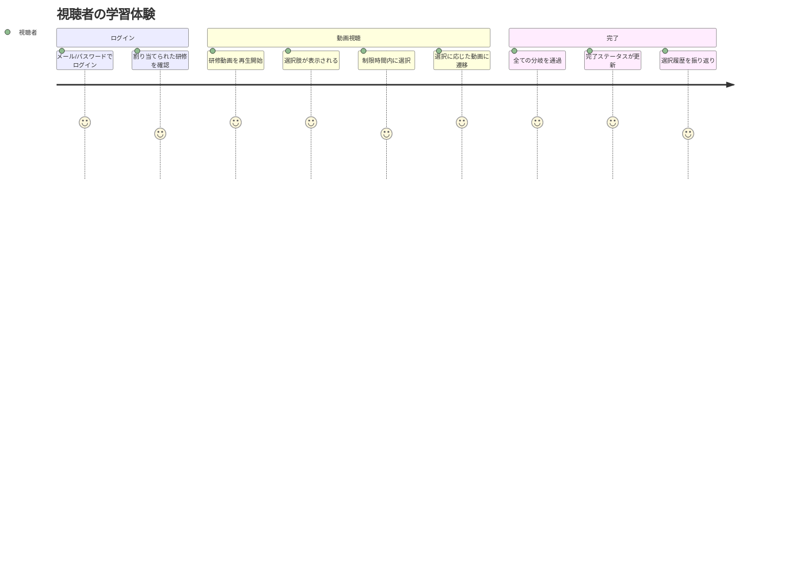
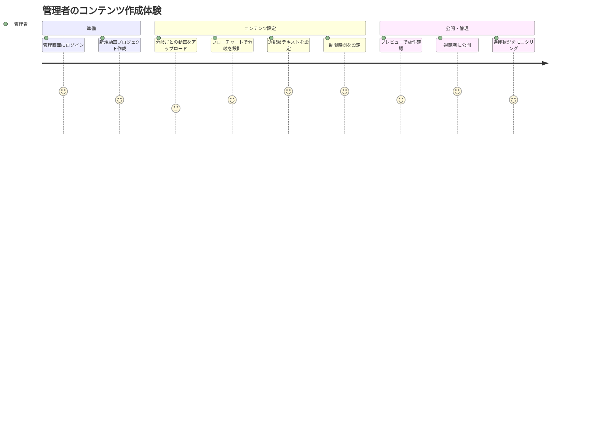
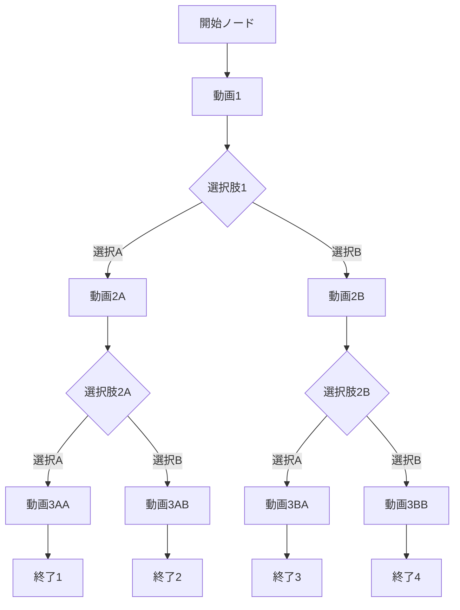
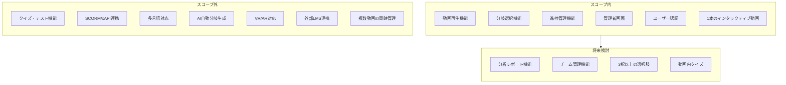

# PRD: インタラクティブ動画プラットフォーム

## メタ情報

| 項目 | 内容 |
|------|------|
| ドキュメントID | PRD-2026-001 |
| バージョン | 1.1.0 |
| 作成日 | 2026-01-14 |
| 最終更新日 | 2026-01-14 |
| ステータス | Draft |
| 作成者 | PRD Creator Agent |

---

## 1. エグゼクティブサマリー

### 1.1 プロダクト概要

社内・チーム向け教育研修用のインタラクティブ動画プラットフォーム。視聴者が動画内で選択肢を選ぶことでストーリーが分岐し、能動的な学習体験を提供する。

### 1.2 ビジネス価値

- **学習効果の向上**: 受動的な動画視聴から能動的な参加型学習へ転換
- **研修完了率の改善**: インタラクティブ要素により、離脱率を削減（業界データによると、インタラクティブコンテンツは従来の動画と比較して完了率が25-40%向上）
- **研修管理の効率化**: 進捗追跡機能により、管理者が学習状況を把握可能
- **柔軟なシナリオ設計**: 分岐構造により、多様な研修シナリオに対応

### 1.3 市場動向

2026年のeラーニング市場は約4,000億ドル規模に成長し、インタラクティブ動画要素が研修体験を受動的から能動的なものへと変革している。特に分岐シナリオ学習は、複雑な意思決定スキルの習得に効果的とされる。

---

## 2. 背景と課題

### 2.1 現状の課題

| 課題 | 影響 |
|------|------|
| 従来の動画研修は受動的 | 49%の従業員が必須研修をスキップして完了扱いにしている |
| 学習状況の可視化が困難 | 誰がどこまで理解したか把握できない |
| 一方通行のコンテンツ | 実務に近い意思決定練習ができない |
| 技術的障壁 | 40%の従業員が技術的問題やUXの悪さを障害と報告 |

### 2.2 解決アプローチ

選択肢を通じたストーリー分岐により、視聴者が主体的に学習に参加。各選択の履歴を記録することで、学習者の思考プロセスを可視化する。

---

## 3. ユーザーペルソナ

### 3.1 視聴者（研修受講者）

| 属性 | 詳細 |
|------|------|
| 役割 | 社員、チームメンバー |
| 目標 | 効率的に研修を完了し、実務に活かせる知識を習得 |
| 課題 | 長時間の動画視聴は集中力が続かない |
| ニーズ | スマートフォンでも快適に学習したい |
| 技術レベル | 一般的なWebアプリケーション利用経験あり |

### 3.2 管理者（研修担当者）

| 属性 | 詳細 |
|------|------|
| 役割 | 人事担当者、チームリーダー、研修担当者 |
| 目標 | 効果的な研修コンテンツを作成し、受講状況を管理 |
| 課題 | 分岐動画の設定が複雑で直感的でない |
| ニーズ | フローチャート形式で視覚的に分岐を設計したい |
| 技術レベル | 基本的なPC操作、ファイルアップロード経験あり |

---

## 4. ユーザージャーニー

### 4.1 視聴者ジャーニー

### 4.2 管理者ジャーニー

### 4.3 ユーザーストーリー

#### 視聴者（研修受講者）として

| ID | ストーリー | 受け入れ条件 |
|----|------------|--------------|
| US-001 | 割り当てられた研修動画を確認したい | ログイン後、自分に割り当てられた動画一覧が表示される |
| US-002 | 前回の続きから視聴を再開したい | 中断した位置から動画が再生される |
| US-003 | 残り時間を確認しながら選択肢を選びたい | 選択肢表示時にカウントダウンタイマーが表示される |
| US-004 | 自分の選択履歴を振り返りたい | 完了後に選択した経路が確認できる |

#### 管理者（研修担当者）として

| ID | ストーリー | 受け入れ条件 |
|----|------------|--------------|
| US-005 | フローチャートで分岐を設計したい | ドラッグ&ドロップでノードを接続できる |
| US-006 | 公開前に動画フローをプレビューしたい | 視聴者と同じ体験でテスト視聴できる |
| US-007 | 研修未完了者を確認したい | 未完了ユーザーの一覧が表示される |
| US-008 | 選択肢の制限時間を設定したい | 各選択肢に個別の制限時間を設定できる |

---

## 5. 機能要件

### 5.1 要件一覧（MoSCoW優先度）

#### Must Have（MVP必須）

| ID | 機能 | 説明 |
|----|------|------|
| F-001 | 動画再生 | MP4形式の動画をブラウザで再生 |
| F-002 | 選択肢表示 | 動画の指定タイミングで2択の選択肢をオーバーレイ表示 |
| F-003 | 分岐遷移 | 選択に応じて対応する動画ファイルに遷移 |
| F-004 | 制限時間 | 選択肢にカウントダウンタイマーを表示（デフォルト10秒） |
| F-005 | ユーザー認証 | メール/パスワードによるログイン |
| F-006 | 権限管理 | 管理者/視聴者の権限分離 |
| F-007 | 動画アップロード | 管理者がMP4ファイルをアップロード（最大500MB、MP4形式、720p/1080p対応） |
| F-008 | 分岐設定UI | フローチャート形式でノードを接続して分岐を設計 |
| F-009 | レスポンシブ対応 | スマートフォン・タブレット・デスクトップで最適表示 |
| F-010 | 完了ステータス | 視聴完了/未完了の管理（いずれかの終了ノードに到達した時点で完了） |

#### Should Have（推奨）

| ID | 機能 | 説明 |
|----|------|------|
| F-011 | 選択履歴記録 | どの選択肢を選んだかの履歴保存 |
| F-012 | 視聴進捗追跡 | どこまで視聴したかの位置記録 |
| F-013 | 視聴時間記録 | 累計視聴時間の記録 |
| F-014 | 管理者ダッシュボード | 全視聴者の進捗一覧表示 |
| F-015 | プレビュー機能 | 公開前に動画フローを確認 |

#### Could Have（将来検討）

| ID | 機能 | 説明 |
|----|------|------|
| F-016 | 複数動画管理 | 複数のインタラクティブ動画を管理 |
| F-017 | チーム管理 | チーム単位での視聴者管理 |
| F-018 | 分析レポート | 選択傾向や完了率の分析 |
| F-019 | 選択肢数拡張 | 3択以上の選択肢対応 |

#### Won't Have（スコープ外）

| ID | 機能 | 理由 |
|----|------|------|
| F-020 | 正解/不正解判定 | ストーリー分岐のみの設計方針 |
| F-021 | クイズ機能 | インタラクティブ動画機能に集中 |
| F-022 | SCORM連携 | 初期スコープでは外部LMS連携不要 |
| F-023 | 多言語対応 | 社内向けのため日本語のみ |

### 5.2 分岐構造の仕様

- 分岐回数: 3〜5回
- 選択肢数: 2択固定
- 制限時間: 設定可能（デフォルト10秒）
- 制限時間超過時の動作: 未選択として記録、動画は一時停止

### 5.3 エラーハンドリング

| エラー種別 | 発生条件 | 対応動作 |
|------------|----------|----------|
| 動画読み込みエラー | 動画ファイルの取得失敗、デコードエラー | エラーメッセージを表示し、リトライボタンを提供。3回失敗で管理者への問い合わせを案内 |
| ネットワーク切断 | 視聴中にネットワーク接続が失われた | 現在の視聴位置を保存し、オフライン状態を通知。再接続後に自動復帰を試行 |
| セッションタイムアウト | 8時間経過後の操作 | 再ログイン画面にリダイレクト。視聴位置は保存済みのため、再ログイン後に続きから視聴可能 |
| 選択肢読み込みエラー | 選択肢データの取得失敗 | 動画を一時停止し、リトライボタンを表示 |
| アップロードエラー | 動画アップロード中の失敗 | 進捗を保持しつつエラー通知。再アップロードボタンを提供 |

---

## 6. スコープ境界図

---

## 7. 非機能要件

### 7.1 パフォーマンス

| 項目 | 要件 |
|------|------|
| 動画読み込み時間 | 初回再生開始まで3秒以内 |
| 選択肢表示遅延 | 指定タイミングから0.5秒以内 |
| 分岐遷移時間 | 選択から次の動画再生まで2秒以内 |
| 同時接続数 | 100ユーザー（初期想定） |
| プリロード | 次の分岐候補動画をバックグラウンドでプリロード |

### 7.2 可用性

| 項目 | 要件 |
|------|------|
| 稼働率 | 99.5%以上（月間ダウンタイム3.6時間以内） |
| バックアップ | 日次バックアップ |
| データ保持期間 | 視聴履歴は1年間保持 |

### 7.3 セキュリティ

| 項目 | 要件 |
|------|------|
| 認証 | メール/パスワード認証 |
| 通信 | HTTPS必須 |
| セッション | セッションタイムアウト（8時間） |
| 権限 | 管理者/視聴者のロールベースアクセス制御 |
| パスワードポリシー | 最小8文字、大文字・小文字・数字・記号を含む |
| アカウントロック | 5回連続ログイン失敗で30分間ロック |
| 動画保護 | 署名付きURL（有効期限1時間） |
| 入力検証 | XSS/CSRF対策を実施 |
| 監査ログ | ログイン、動画アップロード、設定変更を記録 |

### 7.4 対応環境

| 項目 | 要件 |
|------|------|
| ブラウザ | Chrome, Safari, Edge, Firefox（最新2バージョン） |
| デバイス | デスクトップ、タブレット、スマートフォン |
| 最小画面幅 | 320px（iPhone SE対応） |
| 動画形式 | MP4（H.264） |

### 7.5 アクセシビリティ

| 項目 | 要件 |
|------|------|
| 準拠基準 | WCAG 2.1 AA準拠を目標 |
| キーボード操作 | マウスを使わずキーボードのみで全機能を操作可能 |
| フォーカス表示 | フォーカス位置が視覚的に明確に表示される |
| コントラスト | テキストと背景のコントラスト比4.5:1以上 |
| 代替テキスト | 画像・アイコンに適切な代替テキストを提供 |

### 7.6 データプライバシー

| 項目 | 要件 |
|------|------|
| 個人データ範囲 | メールアドレス、氏名、視聴履歴、選択履歴 |
| 退職者データ | 退職日から90日後に自動削除 |
| データエクスポート | 管理者が視聴データをCSV形式でエクスポート可能 |
| データ最小化 | 必要最小限の個人情報のみ収集・保持 |
| 同意管理 | 初回ログイン時にプライバシーポリシーへの同意を取得 |

---

## 8. 技術スタック（参考情報）

| カテゴリ | 技術 |
|----------|------|
| フロントエンド | React / Next.js |
| ホスティング | Vercel |
| 動画ストレージ | Cloudflare R2 |
| データベース | Neon (PostgreSQL) + Drizzle ORM |
| 認証 | Auth.js v5 |

※ 技術的な詳細は技術設計書で定義

---

## 9. 成功指標（KPI）

### 9.1 プロダクト指標

| 指標 | 目標値 | 測定方法 |
|------|--------|----------|
| 研修完了率 | 80%以上 | 完了ユーザー数 / 割当ユーザー数 |
| 平均視聴完了時間 | 動画総時間の90%以上 | 視聴時間 / コンテンツ総時間 |
| 選択肢インタラクション率 | 95%以上 | 選択した回数 / 選択肢表示回数 |
| 制限時間内選択率 | 90%以上 | 時間内選択数 / 総選択肢数 |

### 9.2 ユーザビリティ指標

| 指標 | 目標値 | 測定方法 |
|------|--------|----------|
| モバイル視聴率 | 30%以上 | モバイルからのアクセス数 / 総アクセス数 |
| 離脱率 | 20%以下 | 途中離脱数 / 視聴開始数 |
| エラー発生率 | 1%以下 | エラー発生セッション / 総セッション |

---

## 10. 開発優先度

1. **視聴画面（最優先）**: ユーザーが動画を視聴し、選択肢を選んで分岐する基本体験
2. **管理画面**: 管理者が動画をアップロードし、分岐を設定する機能
3. **進捗管理**: 完了ステータス、選択履歴、視聴時間の記録・表示

---

## 11. 制約事項

### 11.1 ビジネス制約

- 初期スコープは1本のインタラクティブ動画の作成・視聴に限定
- 社内・チーム向けのため、大規模な同時アクセスは想定しない

### 11.2 技術制約

- 動画は分岐ごとに別ファイル（動的結合は行わない）
- 動画形式はMP4（H.264）に限定
- ストリーミング配信ではなくプログレッシブダウンロード

---

## 12. リスクと対策

| リスク | 影響度 | 発生確率 | 対策 |
|--------|--------|----------|------|
| 動画ファイルサイズが大きく読み込みが遅い | 高 | 中 | 動画圧縮ガイドラインの作成、プリロード実装 |
| モバイルでの操作性問題 | 中 | 中 | 早期からモバイルでのテスト実施 |
| 分岐設定UIの複雑化 | 中 | 低 | フローチャートUIの採用、プレビュー機能の充実 |
| 選択肢表示タイミングのずれ | 高 | 低 | 動画メタデータでの精密なタイミング管理 |
| Safari/iOS自動再生制限 | 高 | 高 | ユーザー操作（タップ/クリック）を起点とした再生開始。muted属性の活用。初回タップで再生許可を取得する導線設計 |

---

## 13. 未決定事項

| 項目 | 検討内容 | 決定期限 |
|------|----------|----------|
| データベース選定 | Vercel対応のDB（Supabase, PlanetScale等） | 技術設計時 |
| 認証方式の詳細 | NextAuth vs Supabase Auth等 | 技術設計時 |

※ 制限時間超過時の動作については、Section 5.2で「動画は一時停止」と決定済み
※ 動画の最大ファイルサイズについては、Section 5.1 F-007で500MBと決定済み

---

## 14. 用語集

| 用語 | 定義 |
|------|------|
| インタラクティブ動画 | 視聴者の選択によってストーリーが分岐する動画形式 |
| 分岐ノード | 選択肢が表示される動画内のポイント |
| 選択肢 | 分岐ノードで表示される2つの選択オプション |
| フローチャートUI | ノードと線で分岐構造を視覚的に設計するインターフェース |
| 視聴者 | 研修動画を視聴するユーザー |
| 管理者 | 動画のアップロードや分岐設定を行うユーザー |

---

## 15. 参考資料

### 15.1 市場調査ソース

- [8 Current Training Video Trends: 2026 Data, Analysis](https://research.com/education/training-video-trends)
- [E-learning trends for 2026 to transform corporate training](https://www.iseazy.com/blog/elearning-trends/)
- [The Top 9 eLearning Trends in 2026](https://www.ispringsolutions.com/blog/elearning-trends)
- [Top Learning Technology Trends For 2026](https://elearningindustry.com/top-learning-technology-trends-for-2026-what-ld-must-prepare-for-now)
- [10 Top LMS Trends for 2026](https://research.com/education/lms-trends)

---

## 変更履歴

| バージョン | 日付 | 変更内容 | 変更者 |
|------------|------|----------|--------|
| 1.0.0 | 2026-01-14 | 初版作成 | PRD Creator Agent |
| 1.1.0 | 2026-01-14 | セキュリティ要件強化、ユーザーストーリー追加、アクセシビリティ/データプライバシー要件追加、エラーハンドリング要件追加、技術スタック更新、制限時間超過時動作の矛盾解消 | PRD修正 |
